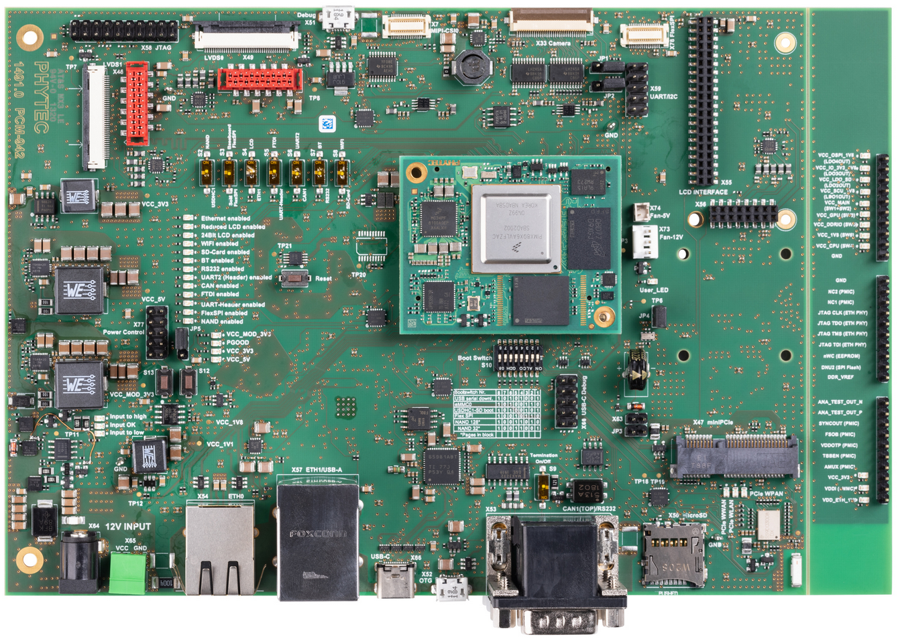
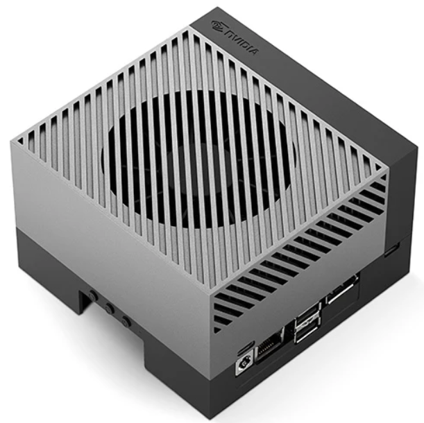
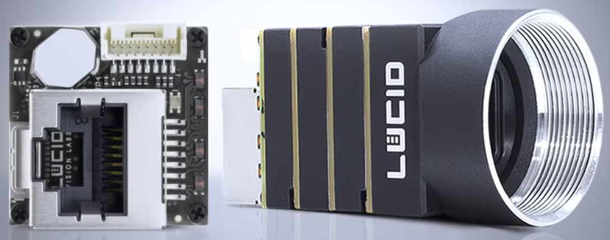

# SCALES Hardware

### [i.MX 8X Developer's Guide](https://scales-docs.readthedocs.io/en/latest/imx8x_procedures/)

How to use the i.MX 8X with the SCALES system.

### [SCALES i.MX 8X Carrier Board + EPS PCB Design]()

Custom carrier board designed for the PHYTEC i.MX 8X SOM that includes the SCALES Power System

### [Peripheral Board Design](https://scales-docs.readthedocs.io/en/latest/peripheral_board/)

Custom board designed for 1Gb ethernet switching.

## FlatSat and Development Hardware

Flight Computer: NXP i.MX 8X on a PHYTEC Development Board

- [NXP Processor](https://www.nxp.com/products/i.MX8X)
- [PHYTEC SOM](https://www.phytec.com/product/phycore-imx8x/)
- [PHYTEC Dev. Kit](https://www.phytec.com/product/phycore-i-mx-8x-development-kit/)

    
    

Edge Computer: NVIDIA Jetson AGX Orin Developer Kit

- [Jetson Dev Kit](https://www.sparkfun.com/nvidia-jetson-agx-orin-64gb-developer-kit.html)

    

Example Payload: LUCID Vision Labs Phoenix Ethernet Camera

- [Ethernet Camera](https://thinklucid.com/product/phoenix-04-mp-imx287/)

    

