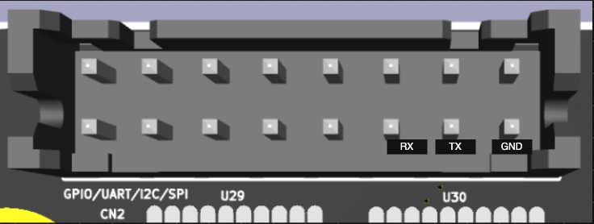
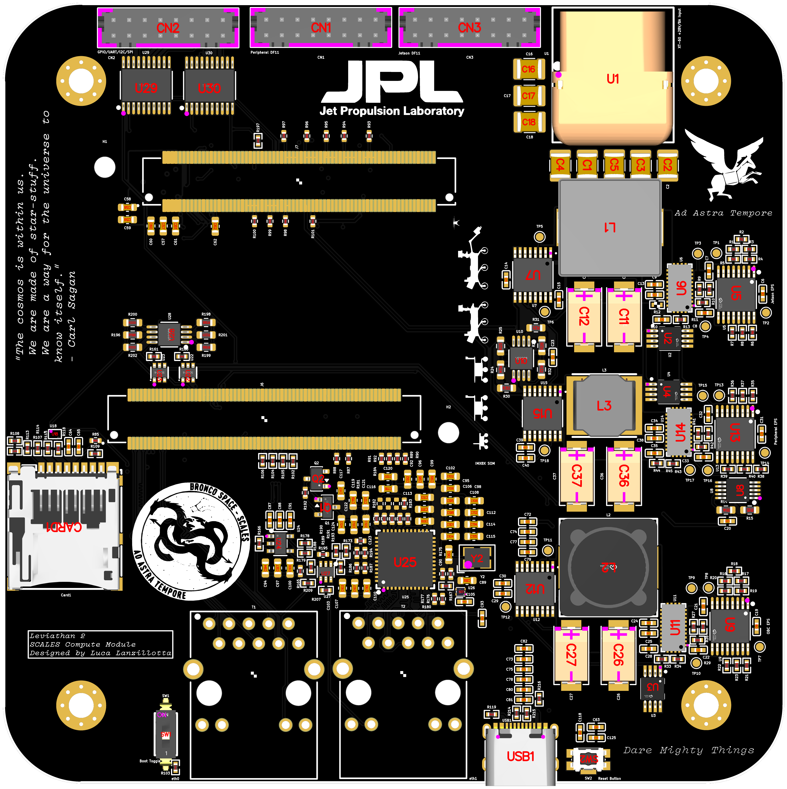
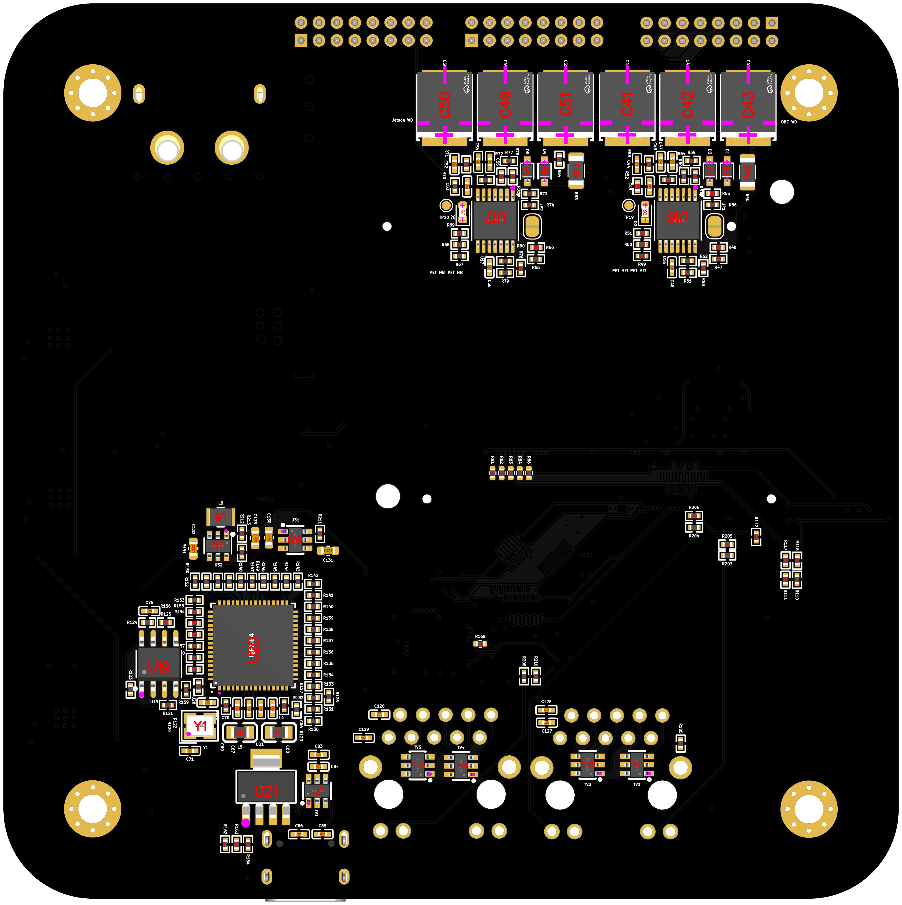

# SCALES Compute Module
By Luca Lanzillotta

## Usage Guide

Using the Leviathan 2 board with the i.MX8X requires building a Linux system image using the SCALES BSP. This BSP includes a pre-installed, startup-enabled `ImxDeployment` from the `fprime-scales-ref` project.

Key repositories:

- [BroncoSpace-Lab/scales-hardware](https://github.com/BroncoSpace-Lab/scales-hardware/tree/main/imx8x_eps_leviathan_v2)  
 KiCad schematic, PCB, and project-local libraries for the current SCALES Compute Module.
- [BroncoSpace-Lab/fprime-scales-ref](https://github.com/BroncoSpace-Lab/fprime-scales-ref)  
  F Prime reference deployment used by the SCALES Compute Module and NVIDIA Jetson.
- [BroncoSpace-Lab/scales-firmware](https://github.com/BroncoSpace-Lab/scales-firmware)  
  Firmware source and supporting software for the SCALES system.
- [BroncoSpace-Lab/meta-scales-leviathan](https://github.com/BroncoSpace-Lab/meta-scales-leviathan)  
  Yocto meta-layer for building the SCALES i.MX8X Linux BSP.

### 1. Set Up Linux for the SCALES Compute Module

1. Follow the [Setup and Build the Custom BSP](imx_yocto_bsp.md) guide.
2. If you choose to, you can build your own [fprime-scales-ref/ImxDeployment](https://github.com/BroncoSpace-Lab/fprime-scales-ref).
3. Flash the built image to an SD card.

!!! note

    If the watchdog solder pads are soldered on the back of the SCALES Compute Module, both the i.MX8X and the Jetson must have preinstalled reference deployments. The Jetson must also have its designated GPIO wired, or it will be power-cycled approximately every 32 seconds by the watchdog circuitry.

### 2. Boot the SCALES Compute Module

1. Set the boot toggle switch to the **SD Card** position.
2. Insert the SD card into the board.
3. Apply power through the XT-60 connector.
4. Wait for the system to boot automatically.

### 3. Open the F Prime GDS

1. Navigate to `fprime-scales-ref` and source the fprime-venv with `source fprime-venv/bin/activate`
2. To setup the gds you must have built for the i.MX8X and Jetson, refer to the [Build the ImxDeployment](#build-the-imxdeployment) section of this document to complete that.
3. Once you have built both deployments (cross compiled locally for the i.MX8X and natively on the Jetson), run the following command:
```
make gds-setup // Combines Imx and Jetson Dictionaries (provided the Jetson Dictionary has been copied over)
```
4. You are ready to run the GDS, there are two options, TCP and UART, both of which can be run simultaneously. TCP GDS is the primary commander until lack of TCP GDS connectivity defaults the GDS authority to UART. You can switch back to TCP using the `SWITCH_TO_TCP` command.
```
make gds-tcp // Runs the Fprime GDS on 127.0.0.1:5000 using TCP
```
```
make gds-uart // Runs the Fprime GDS on 127.0.0.1:5001 using UART
```
5. You can now use SCALES on the i.MX8X. You can now run the demo, refer to the [SCALES Demo](scales_demo.md) document to learn to do this.

### 4. Log in to the SCALES Compute Module

The SCALES Compute Module is accessible over SSH through Ethernet or over a 3.3v USB/TTY serial connection.

#### RJ45 Ethernet SSH Connection

Available IP addresses on the SCALES Compute Module:

```text
10.3.2.10
10.3.2.11
```

1. Plug in a CAT5E or higher Ethernet cable from your host machine to the SCALES Peripheral Board.
2. Connect the SCALES Compute Module to the SCALES Peripheral Board.
3. Check which SCALES Compute Module Ethernet port is connected. The BSP preconfigures `10.3.2.10` for `eth0` and `10.3.2.11` for `eth1`, and the ports are labeled on the PCB.
4. Ensure that your host machine has its ethernet port configured as manual ipv4, set it to 10.3.2.13 with a 255.255.255.0 subnet mask.
5. On your host machine, open PowerShell on Windows or a terminal on Unix systems.
6. SSH into the board using the address for the connected port:

   ```bash
   ssh root@10.3.2.10
   ```

   or:

   ```bash
   ssh root@10.3.2.11
   ```
#### USB/TTY 3.3v Serial Connection

The Yocto embedded linux serial console has been mapped to `LPUART2` for the i.MX8X, meaning it is available via the exposed DF-11 Header on the SCALES Compute Module.
Such connectivity requires a 3.3v USB/TTL Serial Adapter cable. The DF-11 Connector has the bottom right three pins mapped to TX/RX/GND respectively. The image below can be used for reference to wire the adapter.



1. Setup the cable adapter
2. Download `Tabby` a free serial console program
3. Ensure both ends of the cable adapter are plugged in, one to the SCALES Compute Module DF-11 Header, and the other to the USB port of your host machine.
4. Run `Tabby`, and open the detected COM Port at 115200 BAUD
5. User is `root` and the password is `root`

### Build the ImxDeployment
Once you have cloned the `fprime-scales-ref` repo on your host machine, and you have setup the SDK and cross compile toolchain, run the following commands to build the ImxDeployment.

```
make setup main  // Ensures all dependencies are installed on the host machine, and does so with the `main` branch of fprime-scales
make build-imx8x // Generates and builds the ImxDeployment. Use `nogen` flag to skip generation on a simple rebuild (no fpp changes)
make gds-setup   // Built in command that loads both dictionaries, merges them, and spits out the merged file in the /GDS-Dictionary directory
make gds-tcp     // Built in command that runs the GDS with the TCP flag
make gds-uart    // Built in command that runs the GDS with the UART flag 
```

## Hardware Introduction

Leviathan 2 is the merged implementation of the SCALES i.MX8X Carrier Board and the SCALES EPS. It consolidates two previously separate development boards into a single design:

- A revised version of the Leviathan 1A board which served as the first merged implementation of the Mariner 1-C board and the Viking 1-C board.
- A revised version of the Viking 1-C board, the SCALES EPS.

This merged board is designated **Leviathan 2**.

The latest design revisions, SPICE simulation models, and engineering calculations are available in the [scales-hardware](https://github.com/BroncoSpace-Lab/scales-hardware/tree/main/imx8x_eps_leviathan_v2) repository.

---

## Hardware Overview

The Leviathan 2 board contains two primary subsystems:

- i.MX8X carrier board circuitry
- Power system circuitry for the full SCALES platform

---

## Board Images

### Front
{ style="display:block; margin:0 auto; max-width:600px; width:60%; height:60%;" }

### Back
{ style="display:block; margin:0 auto; max-width:600px; width:60%; height:60%;" }

---

## i.MX8X Carrier Board Implementation

The i.MX8X carrier board section is a reduced version of the development platform provided by PHYTEC and includes the interfaces listed below.

Each serial and peripheral interface is explicitly defined in the custom BSP, which provides the Linux kernel with the hardware description for this carrier board. Refer to the Leviathan 2 meta-layer in the BSP for complete details on pin configuration and usage.

For convenience, the exposed signal labels are listed below and may be accessed directly from the operating system.

All GPIO, SPI, I2C, and UART signals made available to the end user are routed through the outermost DF11 connector. Refer to the `scales-hardware` schematic and PCB files for additional implementation details.

### Component Selection

Most of these components are derived directly from the PHYTEC PCM-942 development board schematic. Although alternative components with similar specifications may also be suitable, this design stays as close as possible to the reference implementation for the features included here.

- [SoM Connectors](https://www.samtec.com/products/bth-070-02-l-d-a-k-tr#cadmodels)
- [DF11 Connectors](https://lcsc.com/product-detail/Wire-To-Board-Wire-To-Wire-Connector_HRS-Hirose-HRS-DF11-16DP-2DSA-08_C530981.html)
- [Power Distribution Switch](https://lcsc.com/product-detail/Power-Distribution-Switches_ROHM-Semicon-BD2204GUL-E2_C314699.html?s_z=n_BD2204GUL-E2)
- [MicroSD Card Connector](https://lcsc.com/product-detail/SD-Card-Memory-Card-Connector_MOLEX-5027740891_C330255.html?s_z=n_TF-SMD_5027740891)
- [FTDI Linear Voltage Regulator](https://lcsc.com/product-detail/Linear-Voltage-Regulators_TI_LP38693MP-ADJ-NOPB_LP38693MP-ADJ-NOPB_C181420.html)
- [FTDI Controller](https://lcsc.com/product-detail/USB_FTDI_FT2232HL_FT2232HL_C27882.html)
- [USB-C Connector](https://www.lcsc.com/product-detail/C2765186.html?s_z=n_q_C2765186&globalKeyword=C2765186)
- [SPI EEPROM](https://jlcpcb.com/parts/componentSearch?searchTxt=C890471)
- [FTDI Crystal Oscillator](https://www.lcsc.com/product-detail/C9002.html?s_z=n_C9002)
- [UART Level Shifters](https://lcsc.com/product-detail/Logic-ICs_TI_TXS0101DCKR_TXS0101DCKR_C132031.html)
- [ESD Surge Protector](https://lcsc.com/product-detail/TVS_SEMTECH_SRV05-4-TCT_SRV05-4-TCT_C13612.html)
- [Ethernet PHY-to-MAC 10/100 Base-T Translator](https://www.ti.com/cn/lit/ds/symlink/dp83867ir.pdf?ts=1748027510532&ref_url=https%253A%252F%252Fjlcpcb.com%252F)
- [Ethernet Crystal Oscillator](https://www.lcsc.com/product-detail/C13740.html?s_z=n_C13740)
- [Low-Voltage AND Gate](https://lcsc.com/product-detail/74-Series_TI_SN74AUP1G08DBVR_SN74AUP1G08DBVR_C139409.html)
- [Ethernet TVS Diodes](https://www.lcsc.com/product-detail/C13612.html)
- [RJ45 Connector with Integrated Magnetics](https://www.digikey.com/en/products/detail/w%C3%BCrth-elektronik/7499111121A/3992675)
- [Linear Regulator](https://www.lcsc.com/product-detail/C2872754.html?s_z=n_C2872754)
- [Linear Regulator](https://www.lcsc.com/product-detail/C145717.html)
- [P-Channel MOSFET](https://www.infineon.com/dgdl/irlml6401pbf.pdf?fileId=5546d462533600a401535668b96d2634)
- [N-Channel MOSFET](https://www.onsemi.com/pub/Collateral/BSS138-D.PDF)
- [Switch](https://www.lcsc.com/product-detail/C7471372.html?s_z=n_C7471372)
- [Button](https://www.lcsc.com/product-detail/C72443.html)

### Ethernet

- 2 x 1 Gb Ethernet ports are available
- Ethernet support is configured on the SoM through the BSP
- The supporting circuitry is directly ported from the i.MX8X development board
- Both external RJ45 ports use Wurth Elektronik `7499111121A` integrated-magnetics connectors, which keep the Ethernet magnetics inside the connector body and reduce the amount of discrete magnetics circuitry required on the carrier board
- The Ethernet routing is implemented on the 6-layer KiCad stackup: `F.Cu`, `In1.Cu`, `In2.Cu`, `In3.Cu`, `In4.Cu`, and `B.Cu`
- Ethernet differential pairs are routed for controlled impedance and length/skew tuned in the PCB layout. The KiCad file records tuned Ethernet routes using `0.124 mm` track width with approximately `0.18 mm` to `0.2032 mm` pair gaps, with matching targets used across the Gigabit copper pairs and related Ethernet timing groups
- Two Ethernet configurations are available on the SoM:
  - One is preconfigured on the SoM using an onboard RGMII translator
  - The second is implemented on this carrier board

### USB-to-UART (USB-C)

- UART0 on the SoM is reserved for UART-to-FTDI usage
- The default BSP configures UART0 for debugging
- This interface allows direct transmission and reception of commands and telemetry over UART
- The onboard chip provides UART-to-FTDI translation so the board can interface with a host machine over a serial port
- This design and supporting chip originate from the PHYTEC reference implementation

### MicroSD Card

- The SD card / Wi-Fi muxes have been removed
- This allows default SD card boot configuration and use

### 3.3 V GPIO

Five 3.3 V GPIO pins are made available through a TXS0108 PGOOD buffer.

Exposed GPIOs:

- `GPIO1_17`
- `GPIO1_29`
- `GPIO1_30`
- `GPIO1_26`
- `GPIO1_25`

Reserved internal GPIOs:

- `GPIO1_18` - Peripheral power sequencing
- `GPIO1_19` - Jetson power sequencing
- `GPIO1_20` - OBC watchdog petting

### SPI

SPI is available through a TXS0108 PGOOD buffer.

Exposed SPI signals:

- `SPI2_CS1`
- `SPI2_CS0`
- `SPI2_SCK`
- `SPI2_SDI`
- `SPI2_SDO`

### I2C

Two I2C buses are available on the carrier board.

#### Reserved I2C Bus

`I2C0` is reserved internally for subsystem monitoring and regulator telemetry.

Reserved I2C signals:

- `I2C0_SDA`
- `I2C0_SCL`

Devices on `I2C0`:

- INA260, OBC subsystem: `0x41` (`01000001`)
- INA260, Peripheral subsystem: `0x45` (`01000101`)
- INA260, Jetson subsystem: `0x40` (`01000000`)
- MCP9808, OBC subsystem: `0x19` (`00011001`)
- MCP9808, Peripheral subsystem: `0x1A` (`00011010`)
- MCP9808, Jetson subsystem: `0x1B` (`00011011`)

#### Exposed I2C Bus

The user-accessible I2C bus is exposed as:

- `I2C3_USR_SDA`
- `I2C3_USR_SCL`

### UART

UART is available in two ways:

- Through the FTDI controller over USB
- Through TX and RX pins exposed on the outermost DF11 connector

These signals use 3.3 V logic levels.

Exposed UART signals:

- `UART2_RX`
- `UART2_TX`

### Boot Partition Toggler

If use of the 32 GB eMMC on the SoM is desired, a switch is provided to toggle between boot modes.

- Boot selection is controlled by `BOOTMODE[3:0]`
- `0010` boots from eMMC
- `0011` boots from SD card

Since all other boot configurations have been removed, only the final bit needs to be switched using the onboard selector.

---

## SCALES EPS Implementation

The Leviathan 2 version of the SCALES EPS powers three subsystems: the OBC, the Jetson, and the Peripheral subsystem. The OBC and Jetson both include watchdog protection, while the Peripheral subsystem does not. The Jetson and Peripheral subsystems are designed to be power-sequenced by the OBC within the fprime-scales-ref deployment.

### Power Requirements

The system accepts a nominal `+28 V` input with a maximum current of `8 A`.

Subsystem power requirements:

- ML / Edge Computer - NVIDIA Jetson: `+20 V, 4 A`
- OBC / Flight Computer - i.MX8X: `+3.3 V, 2 A`
- Peripheral System - 5-port Microchip Ethernet switch: `+5 V, 2 A`

### Component Selection

- Load switch and controller: [TPS1HA08-Q1](https://www.ti.com/lit/ds/symlink/tps1ha08-q1.pdf?ts=1748448912035&ref_url=https%253A%252F%252Fwww.ti.com%252Fproduct%252FTPS1HA08-Q1)
- Switching regulator: [LT8612](https://jlcpcb.com/api/file/downloadByFileSystemAccessId/8589836477510287360)
- Current and voltage sensor: [INA260AIPWR](https://jlcpcb.com/api/file/downloadByFileSystemAccessId/8589836477510287360)
- Temperature sensor: [MCP9808](https://www.microchip.com/en-us/product/mcp9800)
- Clock generator: [LTC6902](https://www.analog.com/media/en/technical-documentation/data-sheets/6902f.pdf)
- I2C buffer: [TCA4307](https://www.ti.com/lit/ds/symlink/tca4307.pdf?HQS=dis-dk-null-digikeymode-dsf-pf-null-wwe&ts=1748986173530&ref_url=https%253A%252F%252Fwww.ti.com%252Fgeneral%252Fdocs%252Fsuppproductinfo.tsp%253FdistId%253D10%2526gotoUrl%253Dhttps%253A%252F%252Fwww.ti.com%252Flit%252Fgpn%252Ftca4307)
- Comparator for watchdog circuitry: [TLV1704](https://www.ti.com/lit/ds/symlink/tlv1704-sep.pdf)
- Subsystem connector: [DF-11 (2x8)](https://www.lcsc.com/product-detail/Wire-To-Board-Wire-To-Wire-Connector_HRS-Hirose-HRS-DF11-16DP-2DSA-08_C530981.html)
- Power connector: [XT-60PWF](https://www.lcsc.com/product-detail/plug_Changzhou-Amass-Elec-XT60PW-F_C428722.html)

### Concept of Operations

- The OBC is the primary subsystem and is always enabled
- The OBC controls the ML and Peripheral subsystems through load switches
- The OBC must hold the corresponding subsystem enable pin high for that subsystem to remain active
- The OBC and Jetson each have watchdog protection to verify normal operation

#### Fault Response

**OBC fault**

- If the OBC hangs and fails to pet the watchdog, it is power-cycled. The OBC should always be on by design.
- A built-in Fault Protection Manager was designed and implemented in the flight software, more information about it can be found [here](https://github.com/BroncoSpace-Lab/fprime-scales/blob/lucadev/scales/scalesSvc/FPManager/docs/sdd.md)

**Jetson fault**

- If the Jetson hangs and fails to pet the watchdog, it is rebooted

**Peripheral fault**

- If the Ethernet switch hangs, the OBC can power-sequence it directly, or the FPManager will detect the fault and notify the end user over the GDS

#### Telemetry and Monitoring

- The OBC monitors subsystem current and voltage through the INA260 devices over I2C
- This provides basic telemetry on subsystem operating state
- Three dedicated temperature sensors also report telemetry back to the i.MX8X over a 3.3 V I2C bus
- Such telemetry can be seen in the `fprime-scales-ref` `ImxDeployment` and is visible under **Channels** in the GDS
- Dataproducts can be produced and downlinked to the TCP GDS through the `DataProducer` component. The Downlinked dataproducts can be converted from dataproduct binaries to JSON files, which can then be parsed into .csv files for plotting in excel.

Last updated on 8/5/2026
---
