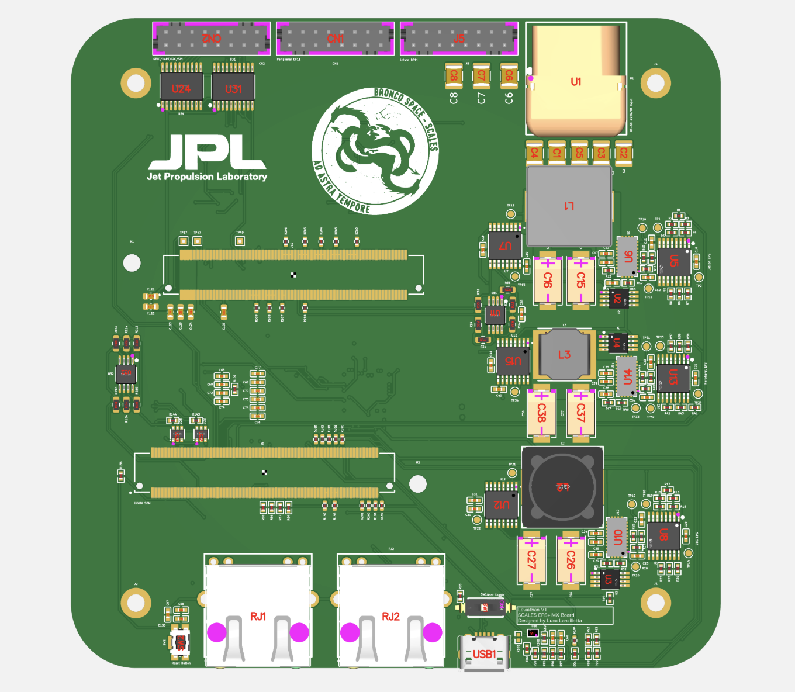
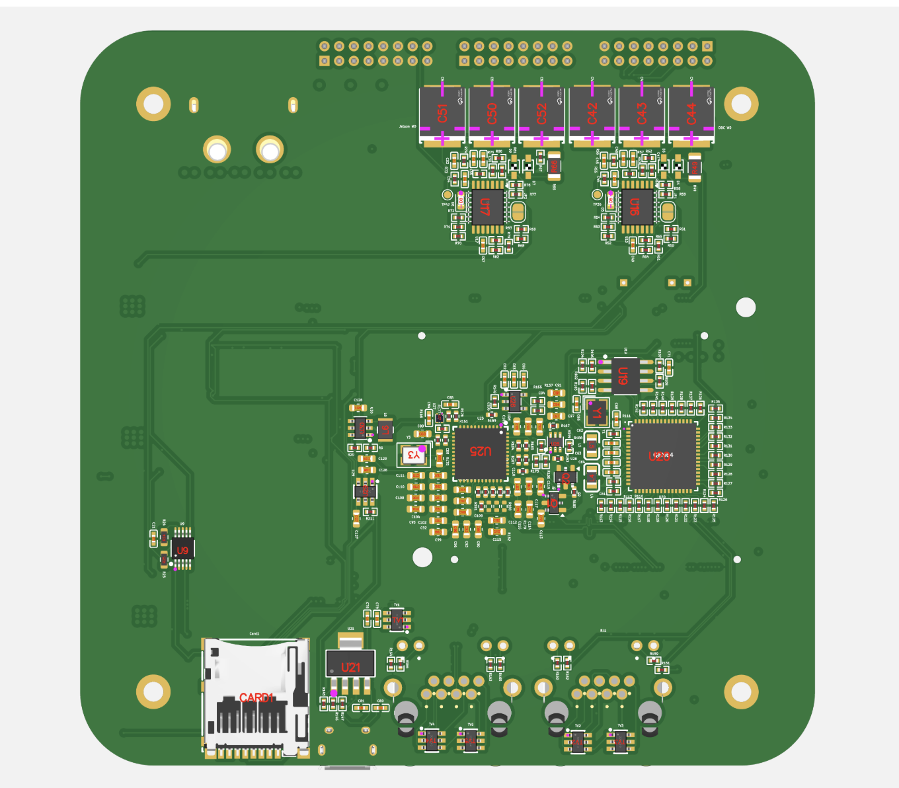

# Leviathan 1A

## Introduction

Leviathan 1A is the merged implementation of the SCALES i.MX8X Carrier Board and the SCALES EPS. It consolidates two previously separate development boards into a single design:

- A revised version of the Mariner 1-C board, which served as the standalone carrier board for the i.MX8X
- The Viking 1-C board, which served as the SCALES EPS

This merged board is designated **Leviathan 1A**.

The latest design revisions, SPICE simulation models, and engineering calculations are available in the [scales-hardware](https://github.com/BroncoSpace-Lab/scales-hardware/tree/IMX_EPS_Merger/imx8x_eps_leviathan) repository.

---

## Hardware Overview

The Leviathan 1A board contains two primary subsystems:

- i.MX8X carrier board circuitry
- Power system circuitry for the full SCALES platform

---

## Board Images

### Front

### Back

---

## i.MX8X Carrier Board Implementation

The i.MX8X carrier board section is a reduced version of the development platform provided by Phytec and includes the interfaces listed below.

Each serial and peripheral interface is explicitly defined in the custom BSP, which provides the Linux kernel with the hardware description for this carrier board. Refer to the Leviathan 1A meta-layer in the BSP for complete details on pin configuration and usage.

For convenience, the exposed signal labels are listed below and may be accessed directly from the operating system.

All GPIO, SPI, I2C, and UART signals made available to the end user are routed through the outermost DF11 connector. Refer to the `scales-hardware` schematic and PCB files for additional implementation details.

### Component Selection

Most of these components are derived directly from the Phytec PCM-942 development board schematic. Although alternative components with similar specifications may also be suitable, this design stays as close as possible to the reference implementation for the features included here.

- [SoM Connectors](https://www.samtec.com/products/bth-070-02-l-d-a-k-tr#cadmodels)
- [DF11 Connectors](https://lcsc.com/product-detail/Wire-To-Board-Wire-To-Wire-Connector_HRS-Hirose-HRS-DF11-16DP-2DSA-08_C530981.html)
- [Power Distribution Switch](https://lcsc.com/product-detail/Power-Distribution-Switches_ROHM-Semicon-BD2204GUL-E2_C314699.html?s_z=n_BD2204GUL-E2)
- [MicroSD Card Connector](https://lcsc.com/product-detail/SD-Card-Memory-Card-Connector_MOLEX-5027740891_C330255.html?s_z=n_TF-SMD_5027740891)
- [FTDI Linear Voltage Regulator](https://lcsc.com/product-detail/Linear-Voltage-Regulators_TI_LP38693MP-ADJ-NOPB_LP38693MP-ADJ-NOPB_C181420.html)
- [FTDI Controller](https://lcsc.com/product-detail/USB_FTDI_FT2232HL_FT2232HL_C27882.html)
- [Micro USB-B Connector](https://lcsc.com/product-detail/USB-Connectors_MOLEX_47346-0001_47346-0001_C132560.html)
- [SPI EEPROM](https://jlcpcb.com/parts/componentSearch?searchTxt=C890471)
- [FTDI Crystal Oscillator](https://www.lcsc.com/product-detail/C9002.html?s_z=n_C9002)
- [UART Level Shifters](https://lcsc.com/product-detail/Logic-ICs_TI_TXS0101DCKR_TXS0101DCKR_C132031.html)
- [ESD Surge Protector](https://lcsc.com/product-detail/TVS_SEMTECH_SRV05-4-TCT_SRV05-4-TCT_C13612.html)
- [Ethernet PHY-to-MAC 10/100 Base-T Translator](https://www.ti.com/cn/lit/ds/symlink/dp83867ir.pdf?ts=1748027510532&ref_url=https%253A%252F%252Fjlcpcb.com%252F)
- [Ethernet Crystal Oscillator](https://www.lcsc.com/product-detail/C13740.html?s_z=n_C13740)
- [Low-Voltage AND Gate](https://lcsc.com/product-detail/74-Series_TI_SN74AUP1G08DBVR_SN74AUP1G08DBVR_C139409.html)
- [Ethernet TVS Diodes](https://www.lcsc.com/product-detail/C13612.html)
- [RJ45 Connector with Integrated Magnetics](https://jlcpcb.com/partdetail/AmphenolIcc-RJHSE5384/C464587)
- [Linear Regulator](https://www.lcsc.com/product-detail/C2872754.html?s_z=n_C2872754)
- [Linear Regulator](https://www.lcsc.com/product-detail/C145717.html)
- [P-Channel MOSFET](https://www.infineon.com/dgdl/irlml6401pbf.pdf?fileId=5546d462533600a401535668b96d2634)
- [N-Channel MOSFET](https://www.onsemi.com/pub/Collateral/BSS138-D.PDF)
- [Switch](https://www.lcsc.com/product-detail/C7471372.html?s_z=n_C7471372)
- [Button](https://www.lcsc.com/product-detail/C72443.html)

### Ethernet

- 2 x 1 Gb Ethernet ports are available
- Ethernet support is configured on the SoM through the BSP
- The supporting circuitry is directly ported from the i.MX8X development board
- Two Ethernet configurations are available on the SoM:
  - One is preconfigured on the SoM using an onboard RGMII translator
  - The second is implemented on this carrier board

### USB-to-UART (Micro USB)

- UART0 on the SoM is reserved for UART-to-FTDI usage
- The default BSP configures UART0 for debugging
- This interface allows direct transmission and reception of commands and telemetry over UART
- The onboard chip provides UART-to-FTDI translation so the board can interface with a host machine over a serial port
- This design and supporting chip originate from the Phytec reference implementation

### MicroSD Card

- The SD card / Wi-Fi muxes have been removed
- This allows default SD card boot configuration and use

### 3.3 V GPIO

Five 3.3 V GPIO pins are made available through a TXS0108 PGOOD buffer.

Exposed GPIOs:

- `GPIO1_17`
- `GPIO1_29`
- `GPIO1_30`
- `GPIO1_26`
- `GPIO1_25`

Reserved internal GPIOs:

- `GPIO1_18` - Peripheral power sequencing
- `GPIO1_19` - Jetson power sequencing
- `GPIO1_20` - OBC watchdog petting

### SPI

SPI is available through a TXS0108 PGOOD buffer.

Exposed SPI signals:

- `SPI2_CS1`
- `SPI2_CS0`
- `SPI2_SCK`
- `SPI2_SDI`
- `SPI2_SDO`

### I2C

Two I2C buses are available on the carrier board.

#### Reserved I2C Bus

`I2C0` is reserved internally for subsystem monitoring and regulator telemetry.

Reserved I2C signals:

- `I2C0_SDA`
- `I2C0_SCL`

Devices on `I2C0`:

- INA260, OBC subsystem: `0x41` (`01000001`)
- INA260, Peripheral subsystem: `0x45` (`01000101`)
- INA260, Jetson subsystem: `0x40` (`01000000`)
- MCP9808, OBC subsystem: `0x19` (`00011001`)
- MCP9808, Peripheral subsystem: `0x1A` (`00011010`)
- MCP9808, Jetson subsystem: `0x1B` (`00011011`)

#### Exposed I2C Bus

The user-accessible I2C bus is exposed as:

- `I2C3_USR_SDA`
- `I2C3_USR_SCL`

### UART

UART is available in two ways:

- Through the FTDI controller over USB
- Through TX and RX pins exposed on the outermost DF11 connector

These signals use 3.3 V logic levels.

Exposed UART signals:

- `UART2_RX`
- `UART2_TX`

### Boot Partition Toggler

If use of the 32 GB eMMC on the SoM is desired, a switch is provided to toggle between boot modes.

- Boot selection is controlled by `BOOTMODE[3:0]`
- `0010` boots from eMMC
- `0011` boots from SD card

Since all other boot configurations have been removed, only the final bit needs to be switched using the onboard selector.

---

## SCALES EPS Implementation

The Leviathan 1A version of the SCALES EPS powers three subsystems: the OBC, the Jetson, and the Peripheral subsystem. The OBC and Jetson both include watchdog protection, while the Peripheral subsystem does not. The Jetson and Peripheral subsystem can be power-sequenced on command by the OBC.

### Power Requirements

The system accepts a nominal `+28 V` input with a maximum current of `8 A`.

Subsystem power requirements:

- ML / Edge Computer - NVIDIA Jetson: `+20 V, 4 A`
- OBC / Flight Computer - i.MX8X: `+3.3 V, 2 A`
- Peripheral System - 5-port Microchip Ethernet switch: `+5 V, 2 A`

### Component Selection

- Load switch and controller: [TPS1HA08-Q1](https://www.ti.com/lit/ds/symlink/tps1ha08-q1.pdf?ts=1748448912035&ref_url=https%253A%252F%252Fwww.ti.com%252Fproduct%252FTPS1HA08-Q1)
- Switching regulator: [LT8612](https://jlcpcb.com/api/file/downloadByFileSystemAccessId/8589836477510287360)
- Current and voltage sensor: [INA260AIPWR](https://jlcpcb.com/api/file/downloadByFileSystemAccessId/8589836477510287360)
- Temperature sensor: [MCP9808](https://www.microchip.com/en-us/product/mcp9800)
- Clock generator: [LTC6902](https://www.analog.com/media/en/technical-documentation/data-sheets/6902f.pdf)
- I2C buffer: [TCA4307](https://www.ti.com/lit/ds/symlink/tca4307.pdf?HQS=dis-dk-null-digikeymode-dsf-pf-null-wwe&ts=1748986173530&ref_url=https%253A%252F%252Fwww.ti.com%252Fgeneral%252Fdocs%252Fsuppproductinfo.tsp%253FdistId%253D10%2526gotoUrl%253Dhttps%253A%252F%252Fwww.ti.com%252Flit%252Fgpn%252Ftca4307)
- Comparator for watchdog circuitry: [TLV1704](https://www.ti.com/lit/ds/symlink/tlv1704-sep.pdf)
- Subsystem connector: [DF-11 (2x8)](https://www.lcsc.com/product-detail/Wire-To-Board-Wire-To-Wire-Connector_HRS-Hirose-HRS-DF11-16DP-2DSA-08_C530981.html)
- Power connector: [XT-60PWF](https://www.lcsc.com/product-detail/plug_Changzhou-Amass-Elec-XT60PW-F_C428722.html)

### Concept of Operations

- The OBC is the primary subsystem and is always enabled
- The OBC controls the ML and Peripheral subsystems through load switches
- The OBC must hold the corresponding subsystem enable pin high for that subsystem to remain active
- The OBC and Jetson each have watchdog protection to verify normal operation

#### Fault Response

**OBC fault**
- If the OBC hangs and fails to pet the watchdog, it is power-cycled
- The load switch enable pin is held high relative to the battery voltage

**Jetson fault**
- If the Jetson hangs and fails to pet the watchdog, it is rebooted

**Peripheral fault**
- If the Ethernet switch hangs, the OBC can power-sequence it directly

#### Telemetry and Monitoring

- The OBC monitors subsystem current and voltage through the INA260 devices over I2C
- This provides basic telemetry on subsystem operating state
- Three dedicated temperature sensors also report telemetry back to the i.MX8X over a 3.3 V I2C bus

---

## Usage Guide

Using the Leviathan 1A board with the i.MX8X is straightforward, but it requires a prebuilt Linux image using the latest SCALES BSP with the updated device tree modifications and additional packages.

Once an SD card has been flashed with the image:

1. Set the boot toggle switch to the **SD Card** position
2. Insert the SD card into the board
3. Apply power through the XT-60 connector
4. The system will boot automatically
5. The default password is `root`

If the watchdog solder pads on the back of the board have been soldered, the BSP must include the watchdog petting package. This ensures that the device does not enter a boot loop.

If this package is not included, leave the watchdog pads unsoldered.

### Setup Resources

- For a custom Linux image setup, refer to this [work-in-progress guide](https://scales-docs.readthedocs.io/en/latest/IMX8X_customBSP/)
- To access the serial terminal over USB, refer to this [guide](https://scales-docs.readthedocs.io/en/latest/imx_yocto_bsp/) and skip to **Flashing and Booting the Board** in Step 3