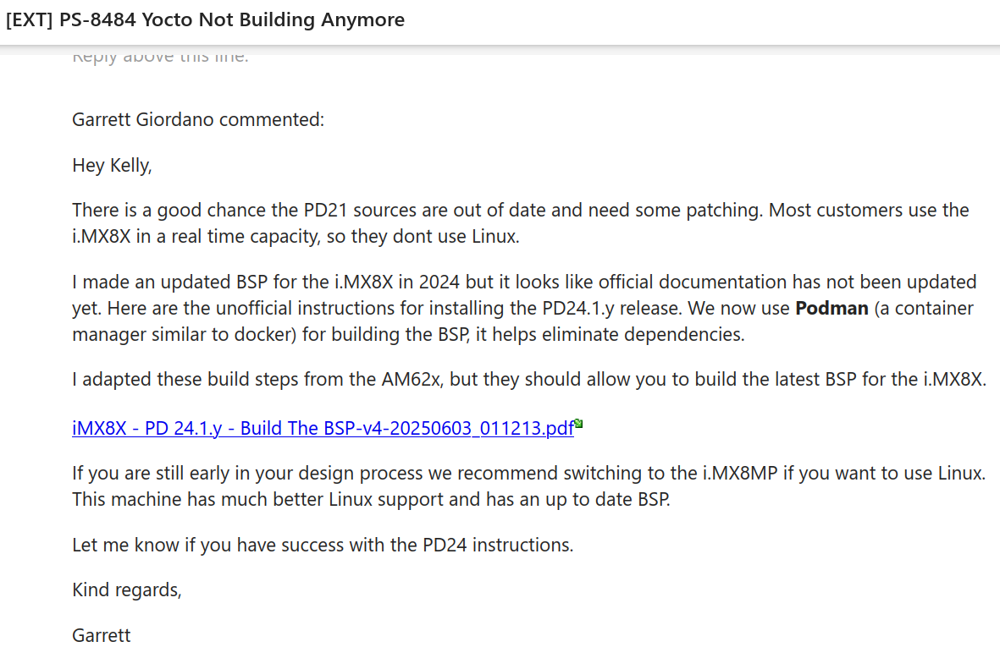
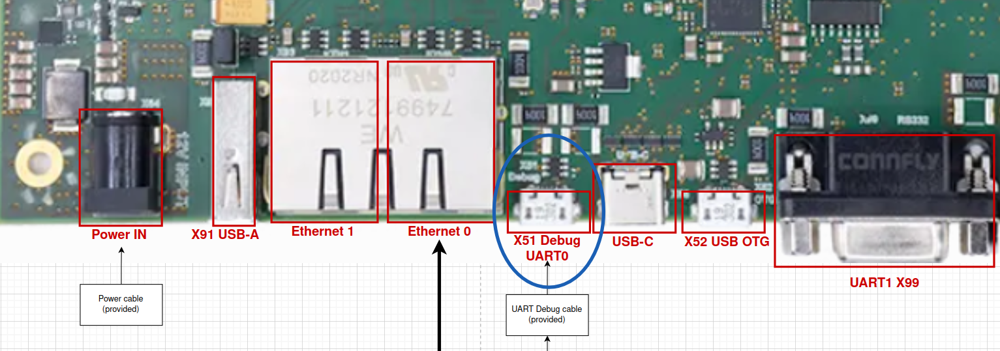
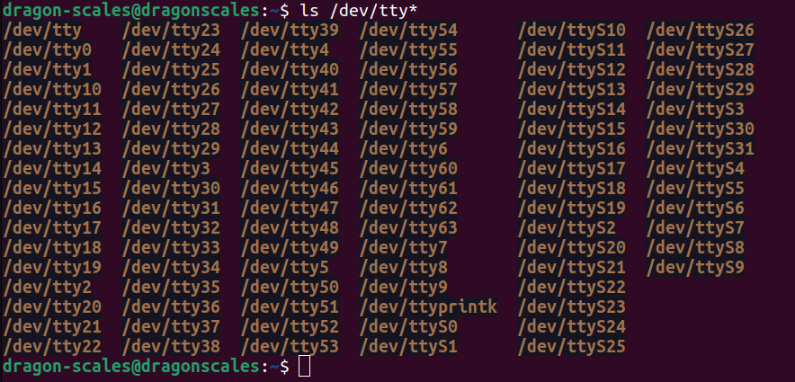
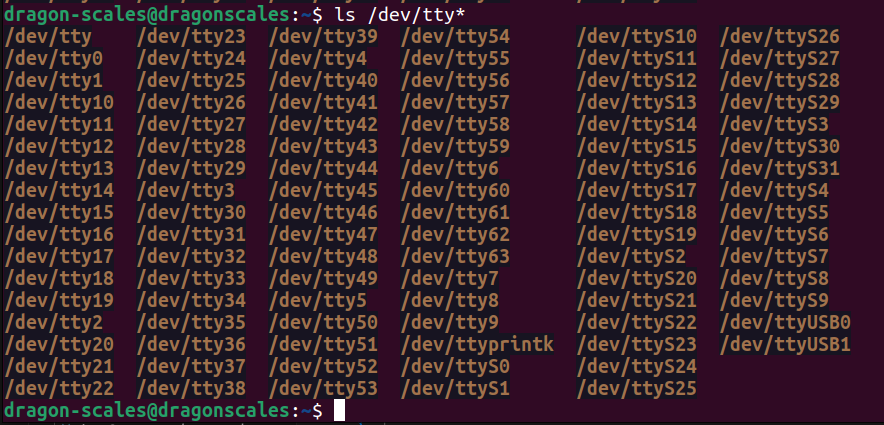
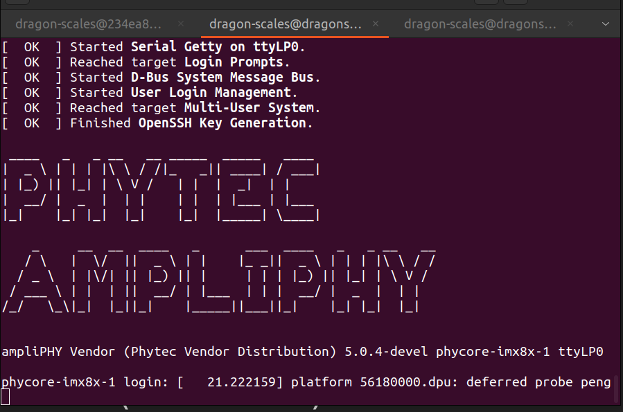

# i.MX 8X Yocto BSP Development and Usage

We are using a custom BSP (board support package) for Yocto Linux v5.0 (scarthgap). The BSP comes directly from Phytec support, and can be built on an Ubuntu 22.04 host machine.

We initially tried to rebuild the BSP they had in their guide to make Yocto v3.0 (zeus) using an Ubuntu 18.04 host machine, but we kept running into errors, so we asked Phytec Support for help. This is what they said:



The guide they sent us will be relayed here.

## Building the BSP

**Requirements**

- Ubuntu 22.04_ LTS, 64-bit Host Machine with root permission
- At least 100GB of free disk space
- At least 8GB of RAM
- Internet Connection
- SD Card

### First-time Setup

1. Install the podman container tool.

    ```
    sudo apt-get update
    sudo apt-get install podman
    ```

2. Make sure your git environment is set up.

    ```
    git config --global user.email "your@gmail.com"
    git config --global user.name "Your Name"
    ```

3. Make a dedicated directory for the BSP and navigate there.

    ```
    mkdir -p ~/BSP-Yocto-NXP-i.MX8X-PD24.1.y/yocto
    cd ~/BSP-Yocto-NXP-i.MX8X-PD24.1.y/yocto
    ```

4. Pull the podman container image provided by PHYTEC.

    ```
    podman pull docker.io/phybuilder/yocto-ubuntu-22.04
    ```

### Configuring the Build

1. Start the podman container. **Run this command every time you want to start a new shell session.**

    ```
    podman run --rm=true -v /home:/home -e USER=$USER --userns=keep-id --workdir=$PWD -it docker.io/phybuilder/yocto-ubuntu-22.04 bash
    ```

2. Download the BSP Meta Layers. This command will lead you through an interactive tool to set up the BSP. The platfrom and release are preselected, so you can just enter `1` when prompted.

    ```
    phyLinux init -p imx8x -r BSP-Yocto-NXP-i.MX8X-PD24.1.y
    ```
    The build and release should look like this:
    ```
    1: phycore-imx8x-1: PHYTEC phyCORE i.MX8X
                        PCM-942.A2, PCM-065-QP28NESI2.A0
                        distro: ampliphy-vendor
                        target: -c populate_sdk phytec-qt6demo-image
                        target: phytec-headless-image
                        target: phytec-qt6demo-image
    ```

3. Initialize the BSP environment. **Run this every time you want to build the BSP.**

    ```
    source sources/poky/oe-init-build-env
    ```

4. Configure the build. Use whatever text editor you want, but this tutorial uses vi. Modify the build's configuration file to accept the EULA.

    ```
    vi conf/local.conf
    ```
    In local.conf:
    ```
    # Uncomment to accept NXP EULA (needed, if any NXP / freescale layer is used)
    # EULA can then be found under ../sources/meta-freescale/EULA
    ACCEPT_FSL_EULA = "1"
    ```
    Optional code for local.conf:
    ```
    # Parallelism options - based on cpu count
    BB_NUMBER_THREADS ?= "4"
    PARALLEL_MAKE ?= "-j 4"
    ```

5. Start the build.

    ```
    cd $BUILDDIR
    bitbake phytec-headless-image
    ```
    If you run into errors, you can clean the build directory with the following:
    ```
    bitbake phytec-headless-image -c cleansstate
    ```

6. Once you have successfully built, the generated images can be found at `$BUILDDIR/deploy-ampliphy-vendor/images`. 

## Flashing and Booting the Board

1. Use [balenaEtcher](https://etcher.balena.io/) to flash one of the generated images to your SD card. We used the image called `phytec-headless-image-phycore-imx8x-1.rootfs-20250604171621.wic.xz`. Your file name may have a different number at the end.

2. Once the SD card is done flashing, insert it into the IMX board. Connect the provided UART Micro USB cable into the Debug port X51 (pictured below). Plug the other end into the host machine.

    

3. Connect to the serial port before you power on the board.

    <details>
    <summary>Using Linux Terminal</summary>

    1. Install minicom.

    ```
    sudo apt-get install minicom
    ```

    2. Check what port the IMX is using by running the following command with and without the UART Debug cable plugged into your computer. In this example, the IMX is using `/dev/ttyUSB0` and `/dev/tty/USB1`.

    ```
    ls /dev/tty*
    ```
    Before IMX is plugged in:

    

    After IMX is plugged in:

    

    3. Connect to the serial ports using minicom. When minicom configuration opens, select `Serial port setup` then select `A` to change the device path to `/dev/ttyUSB0`. The IMX uses one serial port for terminal commands and another for debug. Terminal should be on USB0. Press `Enter` to save changes. Back on the configuration page, select `Exit`. You should be connected to the terminal of the IMX.

    ```
    sudo minicom -s
    ```
    
    4. Once you have connected to the IMX, plug in the power cable. There will be a short boot sequence with an option to stop autoboot. You do not need to stop autoboot. There will evetually be a prompt to enter a password. The default password is `root`.

    </details>

    <details>

    <summary>Using Windows Tera Term</summary>

    1. Do not power the board yet. Connect the UART debug cable to X51 UART0 on the board, and the USB part into your computer. 

    - There are two serial ports that are specific to the i.MX 8X. One will be the debug terminal, and the other will be the main command terminal. Each different Windows host computer will have different names for these ports, so in the next few steps the ports COM15 and COM16 are example ports from Kelly’s computer. 
    - It is a good idea to open both serial ports that appear as options in Tera Term during your first setup, so that you know which ports are which for your specific computer. 

    2. Start Tera Term (Windows computer). Select Serial COM15. Go to Setup > Serial Port. Change the speed to 115200. Press OK. 

        - COM15 is the command terminal. To see the debug terminal, follow the same steps for COM16. 
        - COM15 and 16 may be different on other computers. To be safe, set up both ports on the first boot to your device. 
        - Make sure to set them up before powering the board, or you will miss the sign in prompt. 

    3. Plug in the DC power cable to power on the board. 

    4. Sign in when prompted. Password is “root”. 

    </details>

4. Once you have connected to the IMX, plug in the power cable. There will be a short boot sequence with an option to stop autoboot. You do not need to stop autoboot. There will evetually be a prompt to enter a password. The default password is `root`. The screen should look like this:

    

# Setting up the SDK

1. Make sure you set up the BSP build enviornment (described above), and run the following command to populate the SDK.

    ```
    bitbake phytec-headless-image -c populate_sdk
    ```

2. The SDK files are generated in `BSP-Yocto-NSP-i.MX8X-PD24.1.y/yocyo/build/deploy-ampliphy-vendor/sdk`. Navigate to that directory.

3. Find the file `phytec-ampliphy-vendor-glibc-x86_64-phytec-headless-image-cortexa35-toolchain-5.0.4-devel.sh` and right click to “Run as Program”

4. A window will open to SDK setup. Leave everything as default, you should be able to just hit “Enter”.

5. The toolchains for compiling will be here: `/opt/ampliphy-vendor/5.0.4-devel/sysroots/x86_64-phytecsdk-linux/usr/bin/aarch64-phytec-linux`
