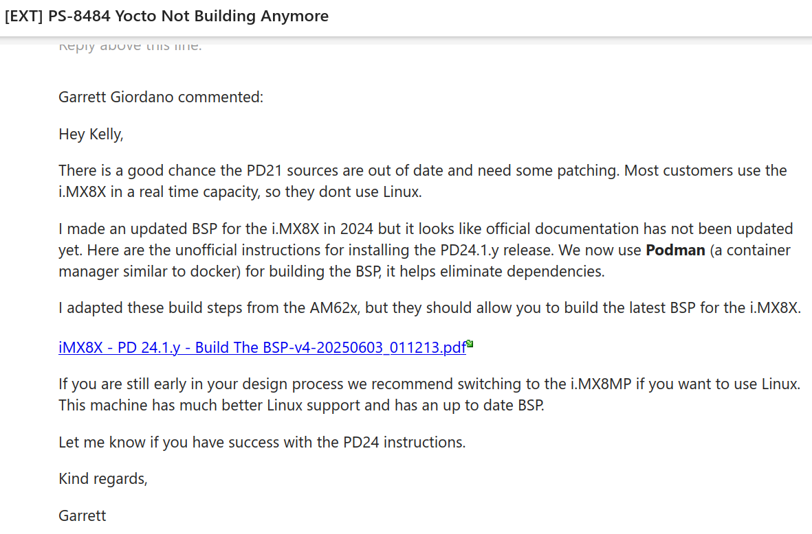
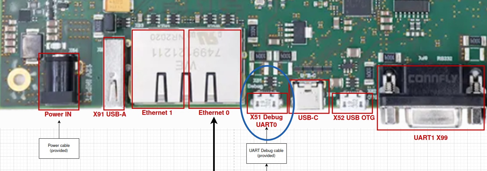
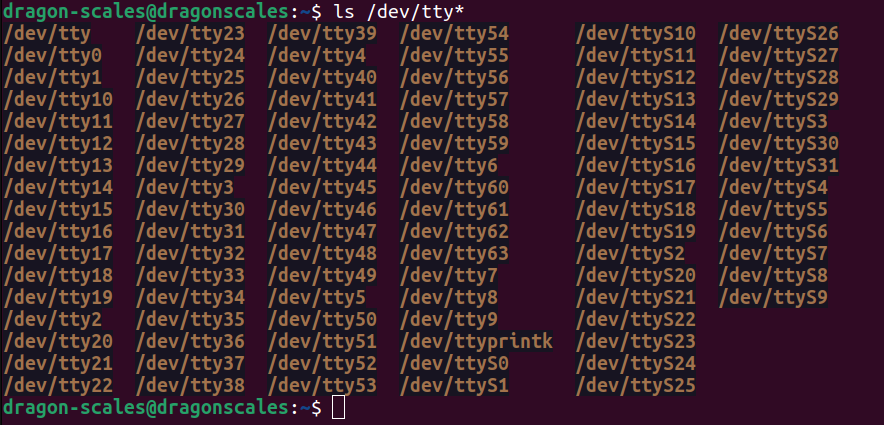
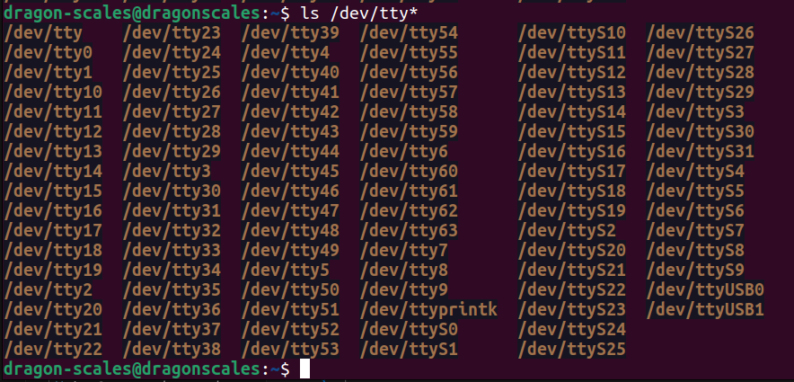
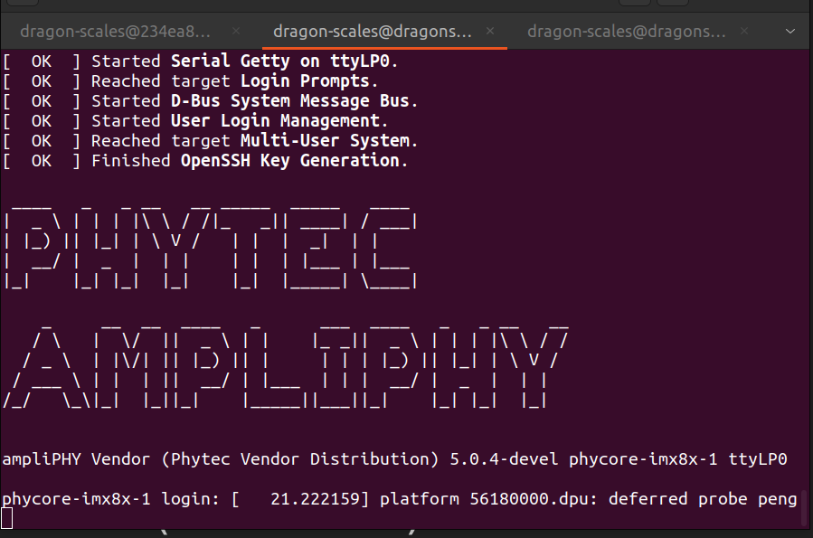
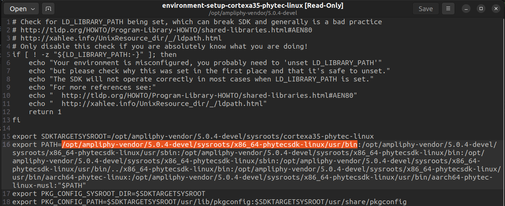
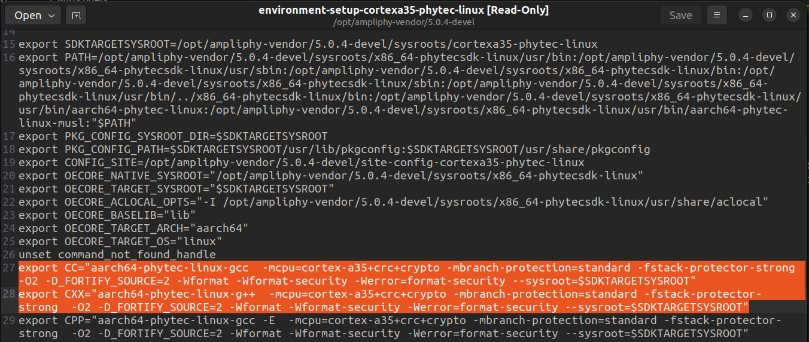
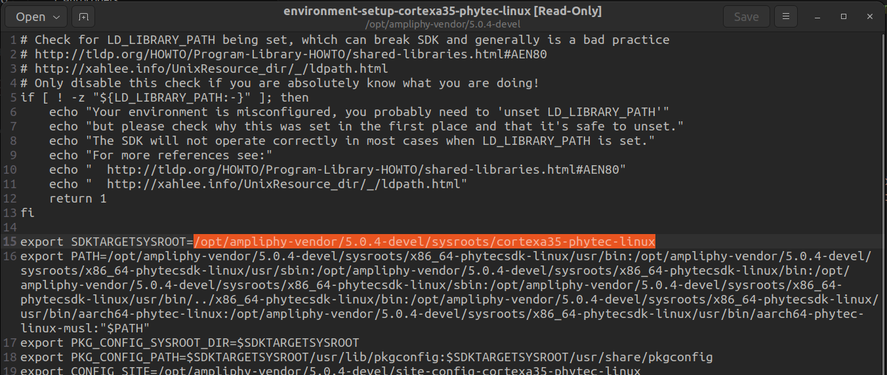

# i.MX 8X Yocto BSP Development and Usage

We are using a custom BSP (board support package) for Yocto Linux v5.0 (scarthgap). The BSP comes directly from Phytec support, and can be built on an Ubuntu 22.04 host machine.

This version of the BSP is only for the [PhyTec i.MX 8X SOM Development Kit](https://www.phytec.com/product/phycore-i-mx-8x-development-kit/).

We initially tried to rebuild the BSP they had in their guide to make Yocto v3.0 (zeus) using an Ubuntu 18.04 host machine, but we kept running into errors, so we asked Phytec Support for help. This is what they said:



The guide they sent us will be relayed here.

## Building the BSP

**Requirements**

- Ubuntu 22.04_ LTS, 64-bit Host Machine with root permission
- At least 100GB of free disk space
- At least 8GB of RAM
- Internet Connection
- SD Card

### First-time Setup

1. Install the podman container tool.

    ```
    sudo apt-get update
    sudo apt-get install podman
    ```

2. Make sure your git environment is set up.

    ```
    git config --global user.email "your@gmail.com"
    git config --global user.name "Your Name"
    ```

3. Make a dedicated directory for the BSP and navigate there.

    ```
    mkdir -p ~/BSP-Yocto-NXP-i.MX8X-PD24.1.y/yocto
    cd ~/BSP-Yocto-NXP-i.MX8X-PD24.1.y/yocto
    ```

4. Pull the podman container image provided by PHYTEC.

    ```
    podman pull docker.io/phybuilder/yocto-ubuntu-22.04
    ```

### Configuring the Build

1. Start the podman container. **Run this command every time you want to start a new shell session.**

    ```
    podman run --rm=true -v /home:/home -e USER=$USER --userns=keep-id --workdir=$PWD -it docker.io/phybuilder/yocto-ubuntu-22.04 bash
    ```

2. Download the BSP Meta Layers. This command will lead you through an interactive tool to set up the BSP. The platfrom and release are preselected, so you can just enter `1` when prompted.

    ```
    phyLinux init -p imx8x -r BSP-Yocto-NXP-i.MX8X-PD24.1.y
    ```
    The build and release should look like this:
    ```
    1: phycore-imx8x-1: PHYTEC phyCORE i.MX8X
                        PCM-942.A2, PCM-065-QP28NESI2.A0
                        distro: ampliphy-vendor
                        target: -c populate_sdk phytec-qt6demo-image
                        target: phytec-headless-image
                        target: phytec-qt6demo-image
    ```

3. Initialize the BSP environment. **Run this every time you want to build the BSP.**

    ```
    source sources/poky/oe-init-build-env
    ```

4. Configure the build. Use whatever text editor you want, but this tutorial uses vi. Modify the build's configuration file to accept the EULA.

    ```
    vi conf/local.conf
    ```
    In local.conf:
    ```
    # Uncomment to accept NXP EULA (needed, if any NXP / freescale layer is used)
    # EULA can then be found under ../sources/meta-freescale/EULA
    ACCEPT_FSL_EULA = "1"
    ```
    Optional code for local.conf:
    ```
    # Parallelism options - based on cpu count
    BB_NUMBER_THREADS ?= "4"
    PARALLEL_MAKE ?= "-j 4"
    ```

5. Start the build.

    ```
    cd $BUILDDIR
    bitbake phytec-headless-image
    ```
    If you run into errors, you can clean the build directory with the following:
    ```
    bitbake phytec-headless-image -c cleansstate
    ```

6. Once you have successfully built, the generated images can be found at `$BUILDDIR/deploy-ampliphy-vendor/images`. 

## Flashing and Booting the Board

1. Use [balenaEtcher](https://etcher.balena.io/) to flash one of the generated images to your SD card. We used the image called `phytec-headless-image-phycore-imx8x-1.rootfs-20250604171621.wic.xz`. Your file name may have a different number at the end.

2. Once the SD card is done flashing, insert it into the IMX board. Connect the provided UART Micro USB cable into the Debug port X51 (pictured below). Plug the other end into the host machine.

    

3. Connect to the serial port before you power on the board.

    <details>
    <summary>Using Linux Terminal</summary>

    1. Install minicom.

    ```
    sudo apt-get install minicom
    ```

    2. Check what port the IMX is using by running the following command with and without the UART Debug cable plugged into your computer. In this example, the IMX is using `/dev/ttyUSB0` and `/dev/tty/USB1`.

    ```
    ls /dev/tty*
    ```
    Before IMX is plugged in:

    

    After IMX is plugged in:

    

    3. Connect to the serial ports using minicom. When minicom configuration opens, select `Serial port setup` then select `A` to change the device path to `/dev/ttyUSB0`. The IMX uses one serial port for terminal commands and another for debug. Terminal should be on USB0. Press `Enter` to save changes. Back on the configuration page, select `Exit`. You should be connected to the terminal of the IMX.

    ```
    sudo minicom -s
    ```
    
    4. Once you have connected to the IMX, plug in the power cable. There will be a short boot sequence with an option to stop autoboot. You do not need to stop autoboot. There will evetually be a prompt to enter a password. The default password is `root`.

    </details>

    <details>

    <summary>Using Windows Tera Term</summary>

    1. Do not power the board yet. Connect the UART debug cable to X51 UART0 on the board, and the USB part into your computer. 

    - There are two serial ports that are specific to the i.MX 8X. One will be the debug terminal, and the other will be the main command terminal. Each different Windows host computer will have different names for these ports, so in the next few steps the ports COM15 and COM16 are example ports from Kelly’s computer. 
    - It is a good idea to open both serial ports that appear as options in Tera Term during your first setup, so that you know which ports are which for your specific computer. 

    2. Start Tera Term (Windows computer). Select Serial COM15. Go to Setup > Serial Port. Change the speed to 115200. Press OK. 

        - COM15 is the command terminal. To see the debug terminal, follow the same steps for COM16. 
        - COM15 and 16 may be different on other computers. To be safe, set up both ports on the first boot to your device. 
        - Make sure to set them up before powering the board, or you will miss the sign in prompt. 

    3. Plug in the DC power cable to power on the board. 

    4. Sign in when prompted. Password is “root”. 

    </details>

4. Once you have connected to the IMX, plug in the power cable. There will be a short boot sequence with an option to stop autoboot. You do not need to stop autoboot. There will evetually be a prompt to enter a password. The default password is `root`. The screen should look like this:

    


# Setting up the SDK

1. Make sure you set up the BSP build enviornment (described above), and run the following command to populate the SDK.

    ```
    bitbake phytec-headless-image -c populate_sdk
    ```

2. The SDK files are generated in `BSP-Yocto-NSP-i.MX8X-PD24.1.y/yocyo/build/deploy-ampliphy-vendor/sdk`. Navigate to that directory.

3. Find the file `phytec-ampliphy-vendor-glibc-x86_64-phytec-headless-image-cortexa35-toolchain-5.0.4-devel.sh` and right click to “Run as Program”

4. A window will open to SDK setup. Leave everything as default, you should be able to just hit “Enter”.

5. The toolchains for compiling will be here: `/opt/ampliphy-vendor/5.0.4-devel/sysroots/x86_64-phytecsdk-linux/usr/bin/aarch64-phytec-linux`

# F Prime Integration

In our F Prime deployment, we use environment variables for the toolchain paths. The following instructions will guide you through setting up global environment variables.

1. To create a global environment variable, start a new terminal session. From your home directory, edit the `/etc/environment/` file.

    ```
    sudo nano /etc/environment
    ```

2. Add a new line defining the variables.

    ```
    IMX_C_COMPILER="/opt/ampliphy-vendor/5.0.4-devel/sysroots/x86_64-phytecsdk-linux/usr/bin/aarch64-phytec-linux/aarch64-phytec-linux-gcc"
    IMX_CXX_COMPILER="/opt/ampliphy-vendor/5.0.4-devel/sysroots/x86_64-phytecsdk-linux/usr/bin/aarch64-phytec-linux/aarch64-phytec-linux-g++"
    IMX_ROOT_PATH="/opt/ampliphy-vendor"
    ```

3. Save and exit the text editor. Restart your computer for the changes to take effect. Once your computer boots up again, you can test your variables with the following commands in terminal:

    ```
    echo $IMX_C_COMPILER
    echo $IMX_CXX_COMPILER
    echo $IMX_ROOT_PATH
    ```

## F Prime CMake Setup

This setup is not required for first time users, as these files have already been created and exist in the current F Prime deployment. This is simply here to show how the files were created.

For more information on how we created the F Prime platform and toolchain files, please refer to the guide below. You can find these files in our [fprime-scales](https://github.com/BroncoSpace-Lab/fprime-scales/tree/main) repo.

1. In [NASA's fprime repo](https://github.com/nasa/fprime), there is a [toolchain template](https://github.com/nasa/fprime/blob/devel/cmake/toolchain/toolchain.cmake.template) in `fprime/cmake/toolchain` called `toolchain.cmake.template`. Make a file in `fprime-scales/cmake/toolchain` called `imx8x.cmake` and copy/paste the toolchain.cmake.template contents from the same directory.

2. Do the same for your platform file. In `fprime-scales/cmake/platform` make a file called `imx8x.cmake` and copy/paste the `platform.cmake.template` contents from `nasa/fprime/cmake/platform`.

3. Find the toolchain path. Look at the `environment-setup-cortexa35-phytec-linux` file in `/opt/ampliphy-vendor/5.0.4-devel`
    
    Look at line 16 beginning with `export PATH`. The first part of the path is `/opt/ampliphy-vendor/5.0.4-devel/sysroots/x86_64-phytecSDK-linux/usr/bin`.

    

    If you look at the files in this directory you will see two folders, `aarch64-phytec-linux` and `aarch64-phytec-linux-musl`. If you pay attention to the path, it follows a pattern. After `/sysroots` there is `/x86_64-phytecSDK-linux` which is the architecture of your host computer. So, to complete the path we must use the `aarch64-phytec-linux` folder since that is the architecture on the IMX8X. That folder contains the toolchains for compilation.

4. Make sure you set up your enironment variables as described in the previous section.

5. Pick which toolchains to use, from the same `environment-setup-cortexa35-phytec-linux` file.

    Look at lines 27 and 28 beginning in `export CC` and `export CXX`. The first argument in each path is which toolchain file to use in the toolchain path we just found. For CC, it is `aarch64-phytec-linux-gcc`, and for CXX it is `aarch64-phytec-linux-g++`.

    

    Add these to your toolchain file.

    ```
    # STEP 3: Specify the path to C and CXX cross compilers
    set (CMAKE_C_COMPILER "${IMX_TOOLCHAIN_DIR}/aarch64-phytec-linux-gcc")
    set (CMAKE_CXX_COMPILER "${IMX_TOOLCHAIN_DIR/aarch64-phytec-linux-g++")
    ```

6. Add compiler options, found in the same `environment-setup-cortexa35-phytec-linux` file.
    
    In the same two lines (27 and 28), the remaining arguments are the same for CC and CXX. These are your compiler options. If you notice, the compiler options end with `--sysroot=$SDKTARGETSYSROOT`. If we left this as-is in the F Prime cmake file, there would be an undefined reference. So, look at line 15 in the environment setup file. It contains the path to that reference.

    

    Replace `$SDKTARGETSYSROOT` with `/opt/ampliphy-vendor/5.0.4-devel/sysroots/cortexa35-phytec-linux` in your toolchain and platform cmake files.

    We also added the `-O` compiler option, due to the [GitHub discussion](https://github.com/nasa/fprime/discussions/3002) from piror compliation issues.

    Code for `toolchain/imx8x.cmake`:

    ```
    add_compile_options(-O -mcpu=cortex-a35+crc+crypto -mbranch-protection=standard -fstack-protector-strong  -O2 -D_FORTIFY_SOURCE=2 -Wformat -Wformat-security -Werror=format-security --sysroot=/opt/ampliphy-vendor/5.0.4-devel/sysroots/cortexa35-phytec-linux)
    ```

    Code for `platform/imx8x.cmake`:

    ```
    # STEP 3: Specify CMAKE C and CXX compile flags. DO NOT clear existing flags
    set(CMAKE_C_FLAGS
    "${CMAKE_C_FLAGS} -mcpu=cortex-a35+crc+crypto -mbranch-protection=standard -fstack-protector-strong  -O2 -D_FORTIFY_SOURCE=2 -Wformat -Wformat-security -Werror=format-security --sysroot=/opt/ampliphy-vendor/5.0.4-devel/sysroots/cortexa35-phytec-linux"
    )
    set(CMAKE_CXX_FLAGS
    "${CMAKE_CXX_FLAGS} -mcpu=cortex-a35+crc+crypto -mbranch-protection=standard -fstack-protector-strong  -O2 -D_FORTIFY_SOURCE=2 -Wformat -Wformat-security -Werror=format-security --sysroot=/opt/ampliphy-vendor/5.0.4-devel/sysroots/cortexa35-phytec-linux"
    )
    ```

7. Finishing `toolchain/imx8x.cmake`.
    
    Complete Step 1 of the template by commenting out or deleting the fail-safe line. 
    
    Complete Step 2 of the template with the system name `"imx8x"`
    
    <details>
    <summary> Code. </summary>
        
        ```powershell
        ## STEP 2: Specify the target system's name. i.e. raspberry-pi-3
        set(CMAKE_SYSTEM_NAME "imx8x")
        ```
    </details>
    
    Complete Step 4 of the template with the following path: `/opt/ampliphy-vendor`
    
    <details>
    <summary> Code. </summary>
        
        ```powershell
        # STEP 4: Specify paths to root of toolchain package, for searching for#         libraries, executables, etc.set (CMAKE_FIND_ROOT_PATH "/opt/ampliphy-vendor")
        ```
    </details>

7. Finishing `platform/imx8x.cmake`
    
    Complete Step 1 of the template by commenting out or deleting the fail-safe line.
    
    Complete Step 2 of the template by specifying `LINUX` as the OS type.
    
    <details>
    <summary> Code. </summary>
        
        ```powershell
        ## STEP 2: Specify the OS type include directive i.e. LINUX or DARWIN
        add_definitions(-DTGT_OS_TYPE_LINUX)
        ```
    </details>
    
    Between Steps 4 and 5, we need to add drivers. Look in `platform/Linux.cmake` and copy/paste the `choose_fprime_implementation` lines to your `platform/imx8x.cmake`. We made one small change to the last two implementation lines, switching from `Linux` to `Stub`. We also added the `# Use common linux setup` and `# Add Linux specific headers into the system` chunks to the `platform/imx8x.cmake` file.
    
    <details>
    <summary> Code. </summary>
        
        ```powershell
        # end of Step 4
        choose_fprime_implementation(Os/File Os/File/Posix)
        choose_fprime_implementation(Os/Console Os/Console/Posix)
        choose_fprime_implementation(Os/Task Os/Task/Posix)
        choose_fprime_implementation(Os/Mutex Os/Mutex/Posix)
        choose_fprime_implementation(Os/Queue Os/Generic/PriorityQueue)
        choose_fprime_implementation(Os/RawTime Os/RawTime/Posix)
        
        choose_fprime_implementation(Os/Cpu Os/Cpu/Stub)
        choose_fprime_implementation(Os/Memory Os/Memory/Stub)
        
        set(FPRIME_USE_POSIX ON)
        # STEP 5: Specify a directory containing the "PlatformTypes.hpp" headers, as well
        #         as other system headers. Other global headers can be placed here.
        #         Note: Typically, the Linux directory is a good default, as it grabs
        #         standard types from <cstdint>.
        add_definitions(-DTGT_OS_TYPE_LINUX)
        # include_directories(SYSTEM "${FPRIME_FRAMEWORK_PATH}/Fw/Types/Linux")
        include_directories(SYSTEM "${CMAKE_CURRENT_LIST_DIR}/types")
        ```
    </details>