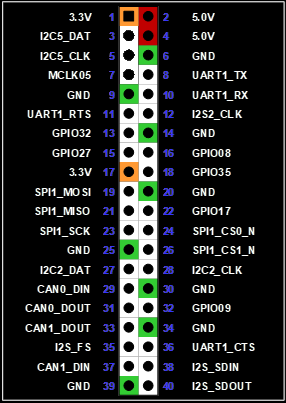

# NVIDIA Jetson AGX Orin
By Luca Lanzillotta

## Usage Guide

The SCALES system uses the NVIDIA Jetson AGX Orin Developer Kit as the edge computer for machine learning and payload processing. The Jetson runs `JetsonDeployment` from the SCALES F Prime reference deployment.

Key repositories and references:

- [BroncoSpace-Lab/fprime-scales-ref](https://github.com/BroncoSpace-Lab/fprime-scales-ref/tree/main)  
  SCALES F Prime reference deployment containing `JetsonDeployment`.
- [NVIDIA Jetson AGX Orin Developer Kit Carrier Board Specification](https://developer.download.nvidia.com/assets/embedded/secure/jetson/agx_orin/Jetson-AGX-Orin-Module-Carrier-Board-Specification_SP-10900-001_v1.2.pdf)  
  Carrier-board connector, interface, power, and mechanical specification used for the hardware overview below.

### 1. Prepare the Jetson
!!! note

    If you are setting up the Jetson for the first time, we recommend using the included USB-C power cable to power the jetson. Once the SCALES Compute Module and the Jetson have installed versions of the flight software that run on boot, you can then power the Jetson using the built in DF11 to DC Jack connector that comes with the SCALES Dev Kit.

1. Flash and boot the Jetson AGX Orin Developer Kit with the required Jetson JetPack image (Version 6.2.2) for the project.
2. Connect the Jetson to an internet connection via wifi.
3. Setup the Jetson Ethernet port to use a manual ipv4 assignment. Set the Jetson IP to be `10.3.2.12` on the `255.255.255.0` subnet mask.
4. Confirm that `python3.12` is installed before running the SCALES setup:

   ```bash
   python3.12 --version
   ```
   ```bash
   // To install python3.12
   sudo apt-get install python3.12
   ```

5. Ensure that `git lfs` is installed, as the Arena SDK setup pulls large files through Git LFS.
6. Install [pytorch for Jetson Platforms](https://docs.nvidia.com/deeplearning/frameworks/install-pytorch-jetson-platform/index.html)

### 2. Set Up `fprime-scales-ref`

To clone and setup SCALES on the Jetson, complete the following commands in a terminal:

```
git clone https://github.com/BroncoSpace-Lab/fprime-scales-ref.git
cd fprime-scales-ref
make setup main
make jetson-setup
make arena-init
source fprime-venv/bin/activate
```

`make setup main` creates the F Prime virtual environment and initializes the repository dependencies using the `main` `fprime-scales-ref` branch. `make arena-init` sets up the Arena SDK used by the Lucid camera integration.

### 3. Generate and Build `JetsonDeployment`
!!! note
    For first time setup, `make jetson-setup` will install the necessary nvpmodel dependency to set the Jetson Power states, as well as install the system service file for the JetsonDeployment.

`JetsonDeployment` should be generated and built directly on the Jetson as SCALES project does not currently use the Jetson cross-compilation toolchain for the `aarch64-linux` deployment.

```
make build-jetson
```

The `make build-jetson` target builds the `aarch64-linux` deployment and sets up the Jetson-side Python/F Prime build environment used by the deployment.
Once the build is complete, the program will prompt you to enter the host machine's username in order to use `scp` to send the JetsonTopologyDictionary.JSON file to the `~/fprime-scales-ref/GDS-Dictionary` folder on the host machine.
After the dictionary is copied, the program will prompt the user to restart the system service file with the new binary.

Once this process is complete, the end user can now create the merged dictionary on the host machine given they have also built the ImxDeployment on the host machine using the `make gds-setup` command within the `fprime-scales-ref` directory having sourced the fprime-venv.

### 4. Wire the Watchdog GPIO

When using the Jetson with the SCALES Compute Module watchdog circuitry, wire one Jetson GPIO to the Jetson watchdog input on the SCALES Compute Module.

- Jetson GPIO Watchdog pin: GPIO27 / Pin 13
- Expected watchdog behavior: `JetsonDeployment` must toggle this GPIO to prevent the SCALES Compute Module watchdog from resetting the Jetson power rail.

{ style="display:block; margin:0 auto; max-width:600px; width:30%; height:30%;" }


## Hardware Overview

The NVIDIA Jetson AGX Orin Developer Kit is built around a Jetson AGX Orin module connected to a developer-kit carrier board. The carrier board exposes the module's high-speed I/O, camera, storage, debug, power, and low-speed expansion interfaces for development and integration.

The SCALES system uses this developer kit as the machine-learning / edge-compute subsystem.

### Major Interfaces

- Jetson AGX Orin module connector: 699-pin board-to-board connector
- Storage:
  - MicroSD card socket
  - M.2 Key M connector for NVMe storage
- USB:
  - Four USB 3.2 Type-A ports total
  - Two USB Type-C connectors
  - USB Micro-B debug connector
- Ethernet:
  - RJ45 connector with built-in magnetics
  - Multi-Gigabit Ethernet support up to 10 Gb/s
- PCIe:
  - Standard PCIe x16 connector
  - Lower x8 portion used for PCIe
  - Upper x8 portion reserved
- Display:
  - VESA DisplayPort output connector
- Camera expansion:
  - 120-pin board-to-board camera expansion connector
  - Up to 16 CSI lanes
  - Supports 6 x 2-lane or 4 x 4-lane camera configurations using DPHY or CPHY
  - Includes camera clock, I2C, and control signals
- M.2 Key E:
  - PCIe x1
  - USB 2.0
  - I2S, UART, and control signals
- 40-pin expansion header:
  - I2C
  - SPI
  - UART
  - I2S
  - CAN
  - Digital microphone
  - PWM
  - GPIO
- Debug and control:
  - JTAG header
  - Power, reset, and force-recovery buttons
  - Automation header
  - RTC backup battery connector
  - Fan connector with 5 V, PWM, and tachometer signals

### Power

The developer kit can be powered through either USB Type-C input using the included 19 V adapter or through the DC power jack. The carrier-board specification lists the DC jack input range as `7 V` to `20 V`.

The carrier board locally generates the platform rails used by the module and carrier-board interfaces, including the main `5 V`, `3.3 V`, and `1.8 V` supplies and additional interface-specific rails for PCIe, USB, DisplayPort, Ethernet PHY, SD, and camera circuits.

### Operating Temperature

The developer-kit operating temperature range listed in the carrier-board specification is `0 C` to `35 C`.

### Board Image

{ width="500" style="display: block; margin: 0 auto;" }

Last updated on 8/5/2026
