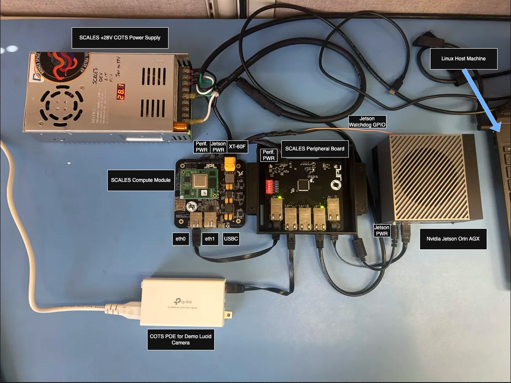

Watch our video demo on [YouTube](https://youtu.be/-g3Wv_fr9r8?si=2xow8_22aNjE1XDO)!

Check out our [docs page](https://scales-docs.readthedocs.io/en/latest/)!

# SCALES Demo

<<<<<<< HEAD
This demo combines the F' Hub Pattern developed by the SCALES team with COTS evaluation boards for the flight computer and edge computer. The demo aims to accomplish the following:

- Test the capability of the split computing architecture
- Test the capability of using a network Ethernet switch in this architecture
- Test the command and data handling aspects of the flight computer
- Test using the Hub Pattern to have the flight computer command the edge computer

Watch our video demo on [YouTube](https://youtu.be/-g3Wv_fr9r8?si=2xow8_22aNjE1XDO)!
=======
This demo demonstrates the capabilities of the SCALES F Prime flight software with SCALES Custom Hardware. The demo demonstrates the capability of F Prime Flight Software with a COTS Flight/Edge Computer in running ML Models with a mock payload.
The i.MX8X Flight Computer evaluation board, Jetson Edge Computer evaluation board, and COTS ethernet camera will be connected through an unmanaged ethernet switch. The i.MX8X will command the Jetson to take a picture using the Ethernet Camera. The picture will be saved on the Jetson, which will then be inferenced on. The inferencing output will be downlinked to the GDS along with the image of which inferencing was performed on.
>>>>>>> lucadev

The code and reference deployment can be found on our [fprime-scales-ref](https://github.com/BroncoSpace-Lab/fprime-scales-ref/tree/main) GitHub.

SCALES v1.3.0 Demo Video Coming Soon!

<<<<<<< HEAD
The i.MX8X SCALES Compute Module, Jetson edge computer evaluation board, and COTS Ethernet camera will be connected through the SCALES Peripheral Board Ethernet switch. The i.MX will command the Jetson through the Hub Pattern to take a picture using the Ethernet camera. The picture will be saved on the Jetson. When completed, the i.MX will command the Jetson through the Hub Pattern to run a computer vision algorithm on the images taken with the camera. The results will be sent to the i.MX.

!!! note
    If you wish to use the UART GDS, run `uart-gds.sh` and do not start the TCP GDS and wait for the backup UART GDS to be given command authority. If you wish you use the TCP GDS, you can start `tcp-gds.sh`, and send the `SWITCH_TO_TCP` command to delegate back the command authority to the TCP GDS. Only one GDS is allowed to give commands at a time. This is to prevent race conditions.



## Process

Using a pre-existing F' deployment, we created a new component called RunLucidCamera. The component provides the following:

- A GDS command to set up the camera and verify that it is connected
- A GDS command to take a picture and save an image from the Ethernet camera

We recycled and modified existing example code from the Ethernet camera's SDK. To do this, we needed to integrate the Arena SDK for the Ethernet camera into the F' deployment.

---

# fprime-scales-ref F' project

Watch our video demo on [YouTube](https://youtu.be/-g3Wv_fr9r8?si=2xow8_22aNjE1XDO)!

Check out our [docs page](https://scales-docs.readthedocs.io/en/latest/)!

## Development Environment

We recommend using the following development environment:

- Ubuntu 22.04 host machine
- Python 3.12
- Git LFS:
  - [amd64 host machine installer](https://git-lfs.com/)
  - [arm64 Jetson installer](https://github.com/git-lfs/git-lfs/releases/download/v3.7.0/git-lfs-linux-arm64-v3.7.0.tar.gz)
- i.MX8X BSP set up on your host machine. See the [i.MX8X BSP setup guide](https://scales-docs.readthedocs.io/en/latest/imx_yocto_bsp/).

## Setup SCALES

It is recommended that you set up all custom hardware according to the guides below. Once all devices are working according to the recommended setup guides, you may continue setting up your development environment.

<a id="hardware-setup"></a>
<details>
<summary><strong>Hardware Setup</strong></summary>

### SCALES Compute Module

The SCALES Compute Module serves as the central processing unit of the system. This module contains an F' framework application that includes the software architecture and flight software components.

- [Setup Guide](https://scales-docs.readthedocs.io/en/latest/imx8x_merger/)

### Peripheral Board

The peripheral board provides connectivity to various peripherals, such as sensors, actuators, and communication interfaces.

- [Setup Guide](https://scales-docs.readthedocs.io/en/latest/peripheral_board/)

### Jetson Orin AGX

The Jetson is a powerful AI computer that runs the F' software on top of the Linux operating system.

- [Setup Guide](https://scales-docs.readthedocs.io/en/latest/nvidia_jetson_orin_agx/)

</details>

Use the commands below in a terminal to clone and set up the repository on both your Linux host machine, which should have the i.MX8X SDK installed, and the Nvidia Jetson Orin AGX.

Before proceeding, make sure you have [Git LFS](https://git-lfs.com/) installed. Also, make sure to source `fprime-venv` before continuing development.

```bash
git clone https://github.com/BroncoSpace-Lab/fprime-scales-ref.git
cd fprime-scales-ref
make setup
source fprime-venv/bin/activate
```

## How to Build ImxDeployment

To generate and build for the i.MX, you need to have the build environment set up on your machine. Refer to the [i.MX SDK setup guide](https://scales-docs.readthedocs.io/en/latest/imx_yocto_bsp/#building-the-bsp) for instructions. Once that setup is complete, you may continue.

**On the Linux host machine**, generate ImxDeployment:

```bash
fprime-util generate imx8x -f
```

Build ImxDeployment:

```bash
fprime-util build imx8x
```

Once your deployment has built, copy the binary over the existing `ImxDeployment` on the i.MX. You can use `scp` to copy the binary over the peripheral board network with a command similar to the one below.

**On the Linux host machine:**

```bash
scp fprime-scales-ref/build-artifacts/imx8x/ImxDeployment/bin/ImxDeployment root@<ip-of-imx>:/tmp/
```

**On the i.MX:**

```bash
# From within /root
mv /tmp/ImxDeployment .
reboot now
```

On the next boot, the new ImxDeployment will be loaded as a system service and run on boot.

Since a deployment has been generated, ensure that its dictionary is copied to `fprime-scales-ref/GDSDictionary` so that once you have the Jetson dictionary, you can merge both dictionaries and run the GDS.

**On the Linux host machine**, copy the i.MX dictionary to the `GDSDictionary` folder:

```bash
cp fprime-scales-ref/build-artifacts/imx8x/ImxDeployment/dict/ImxTopologyDictionary.json fprime-scales-ref/GDSDictionary
```

If the deployment has been copied to the i.MX and you want to test the i.MX alone with the GDS, navigate to the `GDSDictionary` folder and run:

```bash
./test-imx-only.sh
```

This will start the GDS with only the i.MX dictionary. You should see a browser window open, and the GDS icon on the far right should turn from a red X to a green dot.

> **Note:** If you have added or changed sequences, you can recompile them using the dictionaries and copy them over to `/root` on the i.MX. The sequences needed to run the demo come pre-packaged in the SCALES Compute Module BSP.

## How to Build JetsonDeployment

**First-time setup only:** Set up the Arena SDK for the Ethernet camera. Run this command **on the Jetson**:

```bash
make arena-init
```

<details>
<summary><strong>Note: Running without the Ethernet camera</strong></summary>

If you are running this without the Ethernet camera, you can skip this step. Just make sure to comment out the following lines:

- [RunLucidCamera in Components/CMakeLists.txt](https://github.com/BroncoSpace-Lab/fprime-scales-ref/blob/4d7539bd00343ee9b80e19f95b4a6aae525610b0/Components/CMakeLists.txt#L4)
- [`add_fprime_subdirectory("${CMAKE_CURRENT_LIST_DIR}/ArenaSDK/")` in /lib/CMakeLists.txt](https://github.com/BroncoSpace-Lab/fprime-scales-ref/blob/4d7539bd00343ee9b80e19f95b4a6aae525610b0/lib/CMakeLists.txt#L1)

</details>

You must generate and build JetsonDeployment on the Jetson. Cross-compilation for `aarch64-linux` has not been set up yet.

**On the Jetson**, you should be able to generate and build JetsonDeployment. From within `fprime-scales-ref`, source your F' environment:

```bash
source fprime-venv/bin/activate
```

You should now be able to generate and build JetsonDeployment with the commands below:

```bash
fprime-util generate aarch64-linux -f
make build-jetson
```

The `make build-jetson` command will restart the system service with the new deployment and create a linked folder for the camera images.

# Run the SCALES Demo

<a id="imx-setup"></a>
<details>
<summary><strong>i.MX Setup</strong></summary>

These steps are only required if changes have been made to ImxDeployment. Otherwise, the binary on the i.MX should already be current.

1. Follow the instructions above to build ImxDeployment on the host machine.

2. Make sure you are able to ping both the host machine and the Jetson from the i.MX. Then, copy the ImxDeployment binary from the host machine to the i.MX.

    **On the host machine:**

    ```bash
    scp fprime-scales-ref/build-artifacts/imx8x/ImxDeployment/bin/ImxDeployment root@<ip-of-imx>:/tmp/
    ```

    **On the i.MX, from `/root`:**

    ```bash
    mv /tmp/ImxDeployment .
    reboot now
    ```

3. Copy the binary files for the sequences to the i.MX:

    ```bash
    scp fprime-scales-ref/Sequences/save-png.bin root@<ip-of-imx>:/root
    scp fprime-scales-ref/Sequences/batch-send-img.bin root@<ip-of-imx>:/root
    scp fprime-scales-ref/Sequences/snap-n-save.bin root@<ip-of-imx>:/root
    scp fprime-scales-ref/Sequences/Zip-n-send-img.bin root@<ip-of-imx>:/root
    scp fprime-scales-ref/Sequences/test-resnet.bin root@<ip-of-imx>:/root
    scp fprime-scales-ref/Sequences/demo.bin root@<ip-of-imx>:/root
    scp fprime-scales-ref/Sequences/run-ml.bin root@<ip-of-imx>:/root
    ```

</details>

<a id="jetson-setup"></a>
<details>
<summary><strong>Jetson Setup</strong></summary>

1. On the Jetson, follow the directions above to generate and build JetsonDeployment.

2. Make sure the IP of the i.MX is set in `JetsonDeployment/Top/JetsonDeploymentTopology.cpp` and matches the IP of the i.MX:

    ```cpp
    // line 37
    const char* IMX_HUB_IP_ADDRESS = "10.3.2.10";
    ```

3. Rebuild JetsonDeployment:

    ```bash
    make build-jetson
    ```

4. **First-time setup only:** Make a folder with a symbolic link to where the camera images are saved. This ensures that the paths for commands in the fprime-gds are not too long.

    ```bash
    sudo ln -s ~/fprime-scales-ref/build-python-fprime-aarch64-linux/Images/ ./Images
    ```

    The `Images` folder will be created in your root directory.

</details>

<a id="host-setup"></a>
<details>
<summary><strong>Host Setup</strong></summary>

1. Open another terminal on the host machine, enter the repository directory, and source your environment:

    ```bash
    cd fprime-scales-ref
    source fprime-venv/bin/activate
    ```

2. Copy the ImxDeployment dictionary to the `GDS-Dictionary` folder on the host machine:

    ```bash
    cp fprime-scales-ref/build-artifacts/imx8x/ImxDeployment/dict/ImxDeploymentTopologyDictionary.json fprime-scales-ref/GDS-Dictionary/.
    ```

3. Copy the JetsonDeployment dictionary from the Jetson to the host machine:

    ```bash
    scp <jetson-name>@<jetson-ip>:fprime-scales-ref/build-artifacts/aarch64-linux/JetsonDeployment/dict/JetsonDeploymentTopologyDictionary.json fprime-scales-ref/GDS-Dictionary/.
    ```

4. Combine the GDS dictionaries with the `merge-automate.sh` script:

    ```bash
    cd GDS-Dictionary
    ./merge-automate.sh
    ```

    This will generate `GDSDictionary.json`, which contains both the i.MX and Jetson dictionaries merged into one file.

</details>

You are now ready to run the demo.

## Running the Demo

1. After you finish setting up the demo in the previous section, navigate to the `GDS-Dictionary` folder **on the host machine** and run the fprime-gds:

    ```bash
    ./run-gds.sh
    ```

2. **On the i.MX**, the ImxDeployment binary should be running as a system service. You should see a green dot on the fprime-gds and `Accepted client` in the i.MX terminal.

    If the system service is stopped for any reason, you can run:

    ```bash
    ./ImxDeployment -a 0.0.0.0 -p 50000
    ```

3. **On the Jetson**, navigate to the project root directory and run:

    ```bash
    make build-jetson
    ```

    This will restart the system service and run the deployment. Alternatively, if you have stopped the service for any reason, you can run the deployment from within `fprime-scales-ref` by first sourcing `fprime-venv`, then running:

    ```bash
    ./jetson-python.sh
    ```

    This command runs JetsonDeployment through its Python implementation and connects to the i.MX's fprime-gds using the hub pattern. To exit the Python environment, press `Ctrl + C`.

4. **On the host machine**, use the fprime-gds to run `jetson_cmdDisp.CMD_NO_OP` to test the connection with the Jetson. Do the same for the i.MX with `imx_cmdDisp.CMD_NO_OP`. You should see that both events completed in the **Events** tab of the GDS.

5. Once the camera is connected and the camera light is flashing green, run the `jetson_lucidCamera.SETUP_CAMERA` command to verify the connection through fprime.

6. To take a picture with the camera, run the `imx_cmdSeq.CS_RUN` command in the fprime-gds with the argument `demo.bin`. This will take a picture with the camera, downlink it to the i.MX, and then downlink it again to the host machine. You can download the image from the **Downlink** tab in the GDS.

    This sequence will also run a ResNet ML model to identify what is in the image. The output will be displayed in the **Events** tab of the GDS. Images are deleted from the Jetson after the `demo.bin` sequence concludes. Repeat this step if you want to take more images.

    <div style="text-align: center;">
        
    </div>

    This sequence will trigger the images from the Jetson to be downlinked to the i.MX, and then downlinked again from the i.MX to the host machine. Check the **Downlink** tab in the GDS to see the images.

    <div style="text-align: center;">
        
    </div>

    Click the **Download** button in the **Downlink** tab of the fprime-gds to download the zipped image folder to the host machine. You can then unzip the folder and view the images from the Jetson.

### Alternative Commands

1. To send a batch of images from the Jetson to the host machine, run a sequence on the i.MX using the `imx_cmdSeq.CS_RUN` command in the fprime-gds with the `fileName` argument `send.bin`. The command string is as follows:

    ```text
    imx_cmdSeq.CS_RUN, "send.bin", BLOCK
    ```

    <div style="text-align: center;">
        
    </div>

    This sequence will trigger the images from the Jetson to be zipped into a smaller file, downlinked to the i.MX, and then downlinked again from the i.MX to the host machine.

    <div style="text-align: center;">
        
    </div>

    Click the **Download** button in the **Downlink** tab of the fprime-gds to download the zipped image folder to the host machine. You can then unzip the folder and view the images from the Jetson.

2. To run ML on the images, run the `mlManager.SET_ML_PATH` command with the argument `resnet_inference`. Then, set the inference path to where the images are stored with the `mlManager.SET_INFERENCE_PATH` command using the argument `../Images`. Finally, run the ML model with the `mlManager.MULTI_INFERENCE` command. You should see the ML results in both the Jetson terminal and the Jetson fprime-gds **Events** log.

That's how to run the SCALES demo.

Watch our video demo on [YouTube](https://youtu.be/-g3Wv_fr9r8?si=2xow8_22aNjE1XDO)! Some minor changes have been implemented since the video was created, but the core process remains the same.

# To Run Scales-ML

[Scales-ML](https://github.com/BroncoSpace-Lab/Scales-ML/tree/e3aa59f606e9325cd198b787543cea0341d9a19a)

1. Follow the setup described in the previous sections for the i.MX, Jetson, and host machine.

2. In the fprime-gds, run the `imx_cmdSeq.CS_RUN` command with the argument `test-resnet.bin`. This sequence will:

    - Set the ML path to a ResNet model.
    - Set the inference path to a folder called `test-imagery` with example images.
    - Execute the `MULTI_INFERENCE` command to run inference on all images in that folder.

# Running After Making Changes

If you make changes to ImxDeployment or JetsonDeployment, rebuild the respective deployment and repeat the steps to merge the dictionaries.

## Updates to JetsonDeployment

1. Rebuild JetsonDeployment. Run this on the Jetson:

    ```bash
    make build-jetson
    ```

2. Open another terminal on the host machine, enter the repository directory, and source your environment:

    ```bash
    cd fprime-scales-ref
    source fprime-venv/bin/activate
    ```

3. Copy the ImxDeployment dictionary to the `GDS-Dictionary` folder on the host machine:

    ```bash
    cp fprime-scales-ref/build-artifacts/imx8x/ImxDeployment/dict/ImxDeploymentTopologyDictionary.json fprime-scales-ref/GDS-Dictionary/.
    ```

4. Copy the JetsonDeployment dictionary from the Jetson to the host machine:

    ```bash
    scp <jetson-name>@<jetson-ip>:fprime-scales-ref/build-artifacts/aarch64-linux/JetsonDeployment/dict/JetsonDeploymentTopologyDictionary.json fprime-scales-ref/GDS-Dictionary/.
    ```

5. Combine the GDS dictionaries with the `merge-automate.sh` script:

    ```bash
    cd GDS-Dictionary
    ./merge-automate.sh
    ```

    This will generate `GDSDictionary.json`, which contains both the i.MX and Jetson dictionaries merged into one file.

## Updates to ImxDeployment

1. Rebuild ImxDeployment:

    ```bash
    fprime-util build imx8x
    ```

2. Use the following command to SSH into the i.MX:

    ```bash
    ssh root@<ip-of-imx>
    ```

3. Copy the ImxDeployment binary from the host machine to the i.MX. Run this command on the host machine:

    ```bash
    scp fprime-scales-ref/build-artifacts/imx8x/ImxDeployment/bin/ImxDeployment root@<ip-of-imx>:/tmp/
    ```

    **On the i.MX, from within `/root`:**

    ```bash
    mv /tmp/ImxDeployment .
    reboot now
    ```

4. Combine the GDS dictionaries with the `merge-automate.sh` script. Run this command on the host machine. If you also updated JetsonDeployment, make sure to follow the directions above before attempting this step:

    ```bash
    cd GDS-Dictionary
    ./merge-automate.sh
    ```

5. Connect to the fprime-gds.

    **On the host machine**, navigate to the `GDS-Dictionary` folder and run the fprime-gds:

    ```bash
    ./run-gds.sh
    ```

    **On the i.MX**, run the ImxDeployment binary if the service is not already running. You should see a green dot on the fprime-gds and `Accepted client` in the i.MX terminal.

    If the service is stopped or disabled, you can run ImxDeployment with:

    ```bash
    ./ImxDeployment -a 0.0.0.0 -p 50000
    ```

    **On the Jetson**, navigate to the `build-python-fprime-aarch64-linux` directory to run the fprime-gds using Python.

    If you have made changes to JetsonDeployment but have not stopped or disabled the system service, run:

    ```bash
    make build-jetson
    ```

    If you have disabled or stopped the system service, you will have to either re-enable it or run JetsonDeployment from `fprime-scales-ref` using:

    ```bash
    ./jetson-python.sh
    ```

# Troubleshooting

When trying to run the SCALES demo, you may encounter a few issues.

## Arena SDK in F Prime

The Arena SDK was installed from [Lucid](https://thinklucid.com/downloads-hub/).

1. Create a `lib` folder in the root directory of the project.
2. In `fprime-scales-ref/project.cmake`, add the `lib` folder as a subdirectory.
3. Copy the Arena SDK folders into `lib` at `fprime-scales-ref/lib/ArenaSDK`.
4. Create a `CMakeLists.txt` file at `fprime-scales-ref/lib/CMakeLists.txt` and add the following: `add_fprime_subdirectory("${CMAKE_CURRENT_LIST_DIR}/ArenaSDK")`
5. Create a new `CMakeLists.txt` at `fprime-scales-ref/lib/ArenaSDK/CMakeLists.txt` and add the Arena SDK library paths. Currently, the only way this worked was to add the paths to the exact files we wanted.

    ```
    set(MODULE_NAME lib_ArenaSDK)

    add_library(${MODULE_NAME} INTERFACE)
    target_include_directories(${MODULE_NAME} INTERFACE
        ${CMAKE_CURRENT_LIST_DIR}/include/Arena
        ${CMAKE_CURRENT_LIST_DIR}/GenICam/library/CPP/include
        ${CMAKE_CURRENT_LIST_DIR}/include/Save
        ${CMAKE_CURRENT_LIST_DIR}/include/GenTL
        )

    target_link_libraries(${MODULE_NAME} INTERFACE
        # Your existing libraries
        Components_RunLucidCamera

        # Arena SDK libraries - provide full paths to .so or .a files
        ${CMAKE_CURRENT_LIST_DIR}/lib/libarena.so          # Core Arena library
        ${CMAKE_CURRENT_LIST_DIR}/lib/libarena.so.0          # Core Arena library
        ${CMAKE_CURRENT_LIST_DIR}/lib/libsavec.so          # Save functionality
        ${CMAKE_CURRENT_LIST_DIR}/lib/libgentl.so          # GenTL functionality
        ${CMAKE_CURRENT_LIST_DIR}/lib/liblucidlog.so       # Lucid logging
        ${CMAKE_CURRENT_LIST_DIR}/lib/libsave.so
        ${CMAKE_CURRENT_LIST_DIR}/lib/libarenac.so

        ${CMAKE_CURRENT_LIST_DIR}/ffmpeg/libavcodec.so
        ${CMAKE_CURRENT_LIST_DIR}/ffmpeg/libavformat.so
        ${CMAKE_CURRENT_LIST_DIR}/ffmpeg/libavutil.so
        ${CMAKE_CURRENT_LIST_DIR}/ffmpeg/libswresample.so


        # GenICam libraries
        ${CMAKE_CURRENT_LIST_DIR}/GenICam/library/lib/Linux64_ARM/libGenApi_gcc54_v3_3_LUCID.so
        ${CMAKE_CURRENT_LIST_DIR}/GenICam/library/lib/Linux64_ARM/libGCBase_gcc54_v3_3_LUCID.so
        ${CMAKE_CURRENT_LIST_DIR}/GenICam/library/lib/Linux64_ARM/libMathParser_gcc54_v3_3_LUCID.so
        ${CMAKE_CURRENT_LIST_DIR}/GenICam/library/lib/Linux64_ARM/liblog4cpp_gcc54_v3_3_LUCID.so
        ${CMAKE_CURRENT_LIST_DIR}/GenICam/library/lib/Linux64_ARM/libLog_gcc54_v3_3_LUCID.so
        ${CMAKE_CURRENT_LIST_DIR}/GenICam/library/lib/Linux64_ARM/libNodeMapData_gcc54_v3_3_LUCID.so
        ${CMAKE_CURRENT_LIST_DIR}/GenICam/library/lib/Linux64_ARM/libXmlParser_gcc54_v3_3_LUCID.so
    )
    ```

6. In `fprime-scales-ref/Components/RunLucidCamera/RunLucidCamera.cpp`, update the include path to `#include "ArenaApi.h"` and `#include "SaveApi.h"`, and integrate the `CppSave_Png.cpp` example code from the Arena SDK into the `RunLucidCamera.cpp`. The constructor and destructor for the component were modified to include parts of the Arena SDK example code. We also modified the way the example code saves the images so old images do not get overwritten. The current code is available [here](https://github.com/BroncoSpace-Lab/fprime-scales-ref/tree/main/Components/RunLucidCamera).


## Hanging/Crashing During Downlink

This can happen if there is an existing file on the i.MX named `image.png` from a previous incomplete run of the demo. Delete the `image.png` file from the i.MX with `rm image.png`, then try running the demo again.

This may also be due to an issue with the `Images/` folder on the Jetson. Return to step 4 in [Jetson Setup](#jetson-setup) to make sure the `Images/` folder is set up correctly.

## fprime-gds Crashes on Jetson When Trying to Connect
=======
# SCALES Demo Hardware


# To Run the SCALES Demo
!!! note
    It is imperative that your SCALES Hardware stackup has been configured and setup. Both your i.MX8X and Jetson should have the same version of the SCALES reference deployment and the SCALES Ethernet Switch board should be strapped and wired accordingly.
    Please follow the links below to complete the hardware setup.

## Hardware Setup

- [Setup the SCALES Compute Module](imx8x_merger.md)  
  SCALES BSP Installation, ImxDeployment build process, and how to run the GDS.
- [Setup the NVIDIA Jetson AGX Orin](nvidia_jetson_orin_agx.md)  
  Jetson Jetpack version, Pytorch installation, and deployment setup.
- [Setup the SCALES Ethernet Switch Board](peripheral_board.md)

Once you have completed the hardware setup stage, you are ready to configure the Lucid Camera (mock payload) and run the SCALES Demo!
>>>>>>> lucadev

Instead of using the shortened command to connect to the GDS from the Jetson, try entering the Python environment first. Then, run `import python_extension` and `python_extension.main()` one at a time.

<<<<<<< HEAD
## Inferencing Error

When trying to run the `MULTI_INFERENCE` command on the Jetson, you may experience an error similar to:

```text
'(MaxRetryError("HTTPSConnectionPool(host='huggingface.co', port=443): Max retries exceeded with url: /microsoft/resnet-18/resolve/main/preprocessor_config.json (Caused by NewConnectionError('<urllib3.connection.HTTPSConnection object at 0xffff3bf23450>: Failed to establish a new connection: [Errno -3] Temporary failure in name resolution'))"), '(Request ID: 6d6a5cec-e762-484c-a97a-1e1d9748bcba)')' thrown while requesting HEAD https://huggingface.co/microsoft/resnet-18/resolve/main/preprocessor_config.json
```

Make sure the Jetson is connected to Wi-Fi and try again. This is a new issue we have encountered that we are still trying to find the root cause of, but a Wi-Fi connection seems to fix the issue.

---

This project was auto-generated by the F' utility tool.

F' is a component-driven framework that enables rapid development and deployment of spaceflight and other embedded software applications.

**Please visit the F' website:** https://fprime.jpl.nasa.gov.
=======
- The recommended host machine OS is Ubuntu 22.04
- As both a UART and TCP GDS is supported, ensure that you have USB-C cable plugged into the SCALES Compute Module to your host machine, along with an Ethernet Cable from your host machine to the SCALES Ethernet Switch board.

## ImxDeployment and Host Machine Setup

1. The ImxDeployment requires your host machine to have the i.MX8X cross compile toolchain in order to build the binary, if you have not done so already, please follow the [**Setting up the SDK**](imx_yocto_bsp.md#setting-up-the-sdk) and [**F Prime Integration**](imx_yocto_bsp.md#f-prime-integration) sections before proceeding.

2. Once your SCALES Compute Module, SCALES Ethernet Switch Board and NVIDIA Jetson AGX Orin have been plugged into their respective power connectors, and ethernet connectivity has been achieved (make sure you are connected to the 10.3.2.10 ethernet port **eth0**) you may run the following commands from the host machine to generate, build, and run the ImxDeployment on the i.MX8X.

3. On the host machine:
```
make setup main  // Ensures all dependencies are installed on the host machine, and does so with the `main` branch of fprime-scales-ref
make build-imx8x // Generates and builds the ImxDeployment. Use `nogen` flag to skip generation on a simple rebuild (no fpp changes)
make gds-setup   // Built in command that loads both dictionaries, merges them, and spits out the merged file in the /GDS-Dictionary directory
make gds-tcp     // Built in command that runs the GDS with the TCP flag
make gds-uart    // Built in command that runs the GDS with the UART flag 
```
!!! note
    If you are setting up the ImxDeployment on the i.MX8X for the first time, you will have to copy all the *.bin files within the `fprime-scales-ref/Sequences` folder, this is so that the i.MX8X can run the command sequences for the demo and other tests. You can copy them over using the following command. Run this command from within `fprime-scales-ref` on the host machine.

```
make cpseq
```

!!! note
    Both TCP and UART GDS can run at the same time, however only one can command the flight software at once. A 15 second grace period window defaults to UART GDS, prior to that the TCP GDS is the primary commander. Command authority can be delegated back to TCP using the `SWITCH_TO_TCP` command.

4. Both GDS should open on your host machine, if you see a green dot on the top right on either/both GDS you are halfway there!

## JetsonDeployment

1. Assuming you have completed the Jetson hardware setup guide, the Jetson should already have the latest deployment installed with its required nvpmodel and system service file modifications. If this has been completed, you may continue with the demo setup, if not please refer to the [NVIDIA Jetson AGX Orin Setup Guide](nvidia_jetson_orin_agx.md) 

Just in case, here are the following commands you should have run on the Jetson.

```
git clone https://github.com/BroncoSpace-Lab/fprime-scales-ref.git
cd fprime-scales-ref
make setup main
make jetson-setup
make arena-init
source fprime-venv/bin/activate
```

`make setup main` creates the F Prime virtual environment and initializes the repository dependencies using the `main` `fprime-scales-ref` branch. `make arena-init` sets up the Arena SDK used by the Lucid camera integration.

### 3. Generate and Build `JetsonDeployment`
!!! note
    For first time setup, `make jetson-setup` will install the necessary nvpmodel dependency to set the Jetson Power states, as well as install the system service file for the JetsonDeployment.

`JetsonDeployment` should be generated and built directly on the Jetson as SCALES project does not currently use the Jetson cross-compilation toolchain for the `aarch64-linux` deployment.

```
make build-jetson
```

The `make build-jetson` target builds the `aarch64-linux` deployment and sets up the Jetson-side Python/F Prime build environment used by the deployment.
Once the build is complete, the program will prompt you to enter the host machines username in order to use `scp` to send the JetsonTopologyDictionary.JSON file to the `~/fprime-scales-ref/GDS-Dictionary` folder on the host machine.
After the dictionary is copied, the program will prompt the user to restart the system service file with the new binary.

Once this process is complete, the end user can now create the merged dictionary on the host machine given they have also built the ImxDeployment on the host machine using the `make gds-setup` command within the `fprime-scales-ref` directory having sourced the fprime-venv.

## Running the Demo
!!! note
    The SCALES 1.3.0 release requires an internet connection on the Jetson to use ML. It cannot run without it. This will be changed in a future update.

1. **On the host machine**, use the fprime-gds to enable High Performance Compute mode for the SCALES system. Navigate to the `Commands` tab and find `ENABLE_HPC_MODE`, this tells the system that the Jetson is allowed to operate.
2. On the same device, then run the `REQUEST_JETSON_POWER_STATE` command with the `ON` argument. This will turn on the Jetson. You will know the Jetson boots when in the `Events` tab the command returns complete.

2. Connect the camera to the PoE Injector (Camera <-> Injector <-> SCALES Ethernet Switch) and the camera is flashing a green light, run the `jetson_lucidCamera.SETUP_CAMERA` command to verify the connection via fprime. This setup camera command is required.

3. To run the scales demo, be sure that `imx_cmdDisp.CS_AUTO` has been enabled so that the i.MX8X can command recurrent commands through a sequence file. Then once you have seen confirmation of that command completed, navigate to the `imx_cmdDisp.CS_RUN` command, and input the string `demo.bin`. Hit send, and the demo should begin.

    
    
    This sequence will trigger the Images from the Jetson to be downlinked to the i.MX8X, and then again downlinked from the i.MX8X to the Host Machine. Check the `Downlink` tab in the GDS to see the images.

    

    Click the `Download` button in the `Downlink` tab of the fprime-gds to download the image on the host machine.
    Congrats, you have run the demo!

### Alternative Commands

1.  If you would like to send a batch of images from the Jetson to the Host Machine, run a sequence on the i.MX8X using the `imx_cmdSeq.CS_RUN` command on the fprime-gds with fileName argument `send.bin`. The Command String is as follows:

    ```
    imx_cmdSeq.CS_RUN, "send.bin", BLOCK
    ```

    
    
    This sequence will trigger the Images from the Jetson to be zipped into a smaller file to be downlinked to the i.MX8X, and then again downlinked from the i.MX8X to the Host Machine.

    

    Click the `Download` button in the `Downlink` tab of the fprime-gds to download the zipped Image folder to the host machine. You can then unzip the folder and view the images from the Jetson!

2.  To run ML on the images, run the `mlManager.SET_ML_PATH` command with argument `resent_inference`. Then, set the inference path to where the images are stored with the `mlManager.SET_INFERENCE_PATH` command with argument `../Images`. Finally, run the ML model with command `mlManager.MULTI_INFERENCE`. You should see the results of the ML model both in the Jetson's terminal and in the Jetson's fprime-gds Events log.

That's how to run the SCALES demo!

# To Run Scales-ML

[Scales-ML](https://github.com/BroncoSpace-Lab/Scales-ML/tree/e3aa59f606e9325cd198b787543cea0341d9a19a)

1. Follow the setup described in previous sections for the i.MX8X, Jetson, and Host Machine.

2. In the fprime-gds, run the `imx_cmdSeq.CS_RUN` command with argument `test-resnet.bin`. This sequence will:

    - Set the ML path to a resnet model
    - Set the inference path to a folder called `test-imagery` with example images
    - Execute the `MULTI_INFERENCE` command to inference on all images in that folder.
>>>>>>> lucadev
