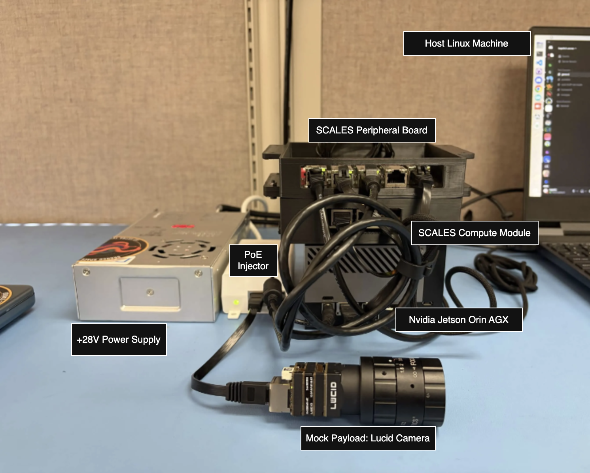
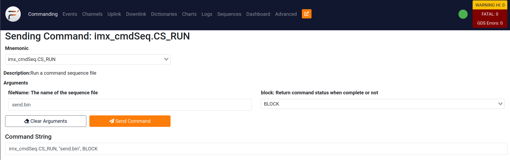
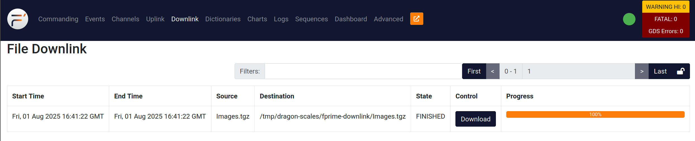

Watch our video demo on [YouTube](https://youtu.be/-g3Wv_fr9r8?si=2xow8_22aNjE1XDO)!

Check out our [docs page](https://scales-docs.readthedocs.io/en/latest/)!

# SCALES Demo

This demo demonstrates the capabilities of the SCALES F Prime flight software with SCALES Custom Hardware. The demo demonstrates the capability of F Prime Flight Software with a COTS Flight/Edge Computer in running ML Models with a mock payload.
The i.MX8X Flight Computer evaluation board, Jetson Edge Computer evaluation board, and COTS ethernet camera will be connected through an unmanaged ethernet switch. The i.MX8X will command the Jetson to take a picture using the Ethernet Camera. The picture will be saved on the Jetson, which will then be inferenced on. The inferencing output will be downlinked to the GDS along with the image of which inferencing was performed on.

The code and reference deployment can be found on our [fprime-scales-ref](https://github.com/BroncoSpace-Lab/fprime-scales-ref/tree/main) GitHub.

[SCALES v1.3.0 Demo Video](https://youtu.be/couJlSxT0MU)

# SCALES Demo Hardware


# To Run the SCALES Demo
!!! note
    It is imperative that your SCALES Hardware stackup has been configured and setup. Both your i.MX8X and Jetson should have the same version of the SCALES reference deployment and the SCALES Ethernet Switch board should be strapped and wired accordingly.
    Please follow the links below to complete the hardware setup.

## Hardware Setup

- [Setup the SCALES Compute Module](imx8x_merger.md)  
  SCALES BSP Installation, ImxDeployment build process, and how to run the GDS.
- [Setup the NVIDIA Jetson AGX Orin](nvidia_jetson_orin_agx.md)  
  Jetson Jetpack version, Pytorch installation, and deployment setup.
- [Setup the SCALES Ethernet Switch Board](peripheral_board.md)

Once you have completed the hardware setup stage, you are ready to configure the Lucid Camera (mock payload) and run the SCALES Demo!

Instead of using the shortened command to connect to the GDS from the Jetson, try entering the Python environment first. Then, run `import python_extension` and `python_extension.main()` one at a time.

- The recommended host machine OS is Ubuntu 22.04
- As both a UART and TCP GDS is supported, ensure that you have USB-C cable plugged into the SCALES Compute Module to your host machine, along with an Ethernet Cable from your host machine to the SCALES Ethernet Switch board.

## ImxDeployment and Host Machine Setup

1. The ImxDeployment requires your host machine to have the i.MX8X cross compile toolchain in order to build the binary, if you have not done so already, please follow the [**Setting up the SDK**](imx_yocto_bsp.md#setting-up-the-sdk) and [**F Prime Integration**](imx_yocto_bsp.md#f-prime-integration) sections before proceeding.

2. Once your SCALES Compute Module, SCALES Ethernet Switch Board and NVIDIA Jetson AGX Orin have been plugged into their respective power connectors, and ethernet connectivity has been achieved (make sure you are connected to the 10.3.2.10 ethernet port **eth0**) you may run the following commands from the host machine to generate, build, and run the ImxDeployment on the i.MX8X.

3. On the host machine:
```
make setup main  // Ensures all dependencies are installed on the host machine, and does so with the `main` branch of fprime-scales-ref
make build-imx8x // Generates and builds the ImxDeployment. Use `nogen` flag to skip generation on a simple rebuild (no fpp changes)
make gds-setup   // Built in command that loads both dictionaries, merges them, and spits out the merged file in the /GDS-Dictionary directory
make gds-tcp     // Built in command that runs the GDS with the TCP flag
make gds-uart    // Built in command that runs the GDS with the UART flag 
```
!!! note
    If you are setting up the ImxDeployment on the i.MX8X for the first time, you will have to copy all the *.bin files within the `fprime-scales-ref/Sequences` folder, this is so that the i.MX8X can run the command sequences for the demo and other tests. You can copy them over using the following command. Run this command from within `fprime-scales-ref` on the host machine.

```
make cpseq
```

!!! note
    Both TCP and UART GDS can run at the same time, however only one can command the flight software at once. A 15 second grace period window defaults to UART GDS, prior to that the TCP GDS is the primary commander. Command authority can be delegated back to TCP using the `SWITCH_TO_TCP` command.

4. Both GDS should open on your host machine, if you see a green dot on the top right on either/both GDS you are halfway there!

## JetsonDeployment

1. Assuming you have completed the Jetson hardware setup guide, the Jetson should already have the latest deployment installed with its required nvpmodel and system service file modifications. If this has been completed, you may continue with the demo setup, if not please refer to the [NVIDIA Jetson AGX Orin Setup Guide](nvidia_jetson_orin_agx.md) 

Just in case, here are the following commands you should have run on the Jetson.

```
git clone https://github.com/BroncoSpace-Lab/fprime-scales-ref.git
cd fprime-scales-ref
make setup main
make jetson-setup
make arena-init
source fprime-venv/bin/activate
```

`make setup main` creates the F Prime virtual environment and initializes the repository dependencies using the `main` `fprime-scales-ref` branch. `make arena-init` sets up the Arena SDK used by the Lucid camera integration.

### 3. Generate and Build `JetsonDeployment`
!!! note
    For first time setup, `make jetson-setup` will install the necessary nvpmodel dependency to set the Jetson Power states, as well as install the system service file for the JetsonDeployment.

`JetsonDeployment` should be generated and built directly on the Jetson as SCALES project does not currently use the Jetson cross-compilation toolchain for the `aarch64-linux` deployment.

```
make build-jetson
```

The `make build-jetson` target builds the `aarch64-linux` deployment and sets up the Jetson-side Python/F Prime build environment used by the deployment.
Once the build is complete, the program will prompt you to enter the host machines username in order to use `scp` to send the JetsonTopologyDictionary.JSON file to the `~/fprime-scales-ref/GDS-Dictionary` folder on the host machine.
After the dictionary is copied, the program will prompt the user to restart the system service file with the new binary.

Once this process is complete, the end user can now create the merged dictionary on the host machine given they have also built the ImxDeployment on the host machine using the `make gds-setup` command within the `fprime-scales-ref` directory having sourced the fprime-venv.

## Running the Demo
!!! note
    The SCALES 1.3.0 release requires an internet connection on the Jetson to use ML. It cannot run without it. This will be changed in a future update.

1. **On the host machine**, use the fprime-gds to enable High Performance Compute mode for the SCALES system. Navigate to the `Commands` tab and find `ENABLE_HPC_MODE`, this tells the system that the Jetson is allowed to operate.
2. On the same device, then run the `REQUEST_JETSON_POWER_STATE` command with the `ON` argument. This will turn on the Jetson. You will know the Jetson boots when in the `Events` tab the command returns complete.

2. Connect the camera to the PoE Injector (Camera <-> Injector <-> SCALES Ethernet Switch) and the camera is flashing a green light, run the `jetson_lucidCamera.SETUP_CAMERA` command to verify the connection via fprime. This setup camera command is required.

3. To run the scales demo, be sure that `imx_cmdDisp.CS_AUTO` has been enabled so that the i.MX8X can command recurrent commands through a sequence file. Then once you have seen confirmation of that command completed, navigate to the `imx_cmdDisp.CS_RUN` command, and input the string `demo.bin`. Hit send, and the demo should begin.

    
    
    This sequence will trigger the Images from the Jetson to be downlinked to the i.MX8X, and then again downlinked from the i.MX8X to the Host Machine. Check the `Downlink` tab in the GDS to see the images.

    

    Click the `Download` button in the `Downlink` tab of the fprime-gds to download the image on the host machine.
    Congrats, you have run the demo!

### Alternative Commands

1.  If you would like to send a batch of images from the Jetson to the Host Machine, run a sequence on the i.MX8X using the `imx_cmdSeq.CS_RUN` command on the fprime-gds with fileName argument `send.bin`. The Command String is as follows:

    ```
    imx_cmdSeq.CS_RUN, "send.bin", BLOCK
    ```

    
    
    This sequence will trigger the Images from the Jetson to be zipped into a smaller file to be downlinked to the i.MX8X, and then again downlinked from the i.MX8X to the Host Machine.

    

    Click the `Download` button in the `Downlink` tab of the fprime-gds to download the zipped Image folder to the host machine. You can then unzip the folder and view the images from the Jetson!

2.  To run ML on the images, run the `mlManager.SET_ML_PATH` command with argument `resent_inference`. Then, set the inference path to where the images are stored with the `mlManager.SET_INFERENCE_PATH` command with argument `../Images`. Finally, run the ML model with command `mlManager.MULTI_INFERENCE`. You should see the results of the ML model both in the Jetson's terminal and in the Jetson's fprime-gds Events log.

That's how to run the SCALES demo!

# To Run Scales-ML

[Scales-ML](https://github.com/BroncoSpace-Lab/Scales-ML/tree/e3aa59f606e9325cd198b787543cea0341d9a19a)

1. Follow the setup described in previous sections for the i.MX8X, Jetson, and Host Machine.

2. In the fprime-gds, run the `imx_cmdSeq.CS_RUN` command with argument `test-resnet.bin`. This sequence will:

    - Set the ML path to a resnet model
    - Set the inference path to a folder called `test-imagery` with example images
    - Execute the `MULTI_INFERENCE` command to inference on all images in that folder.
