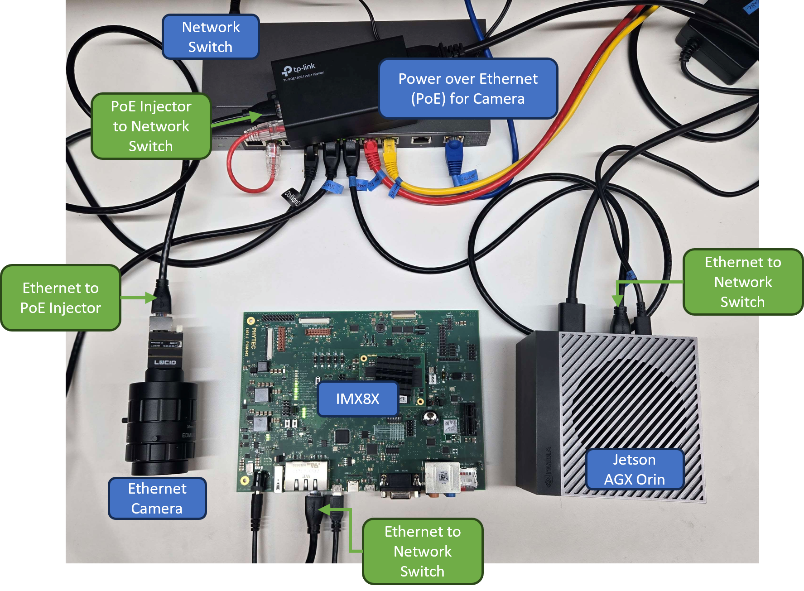
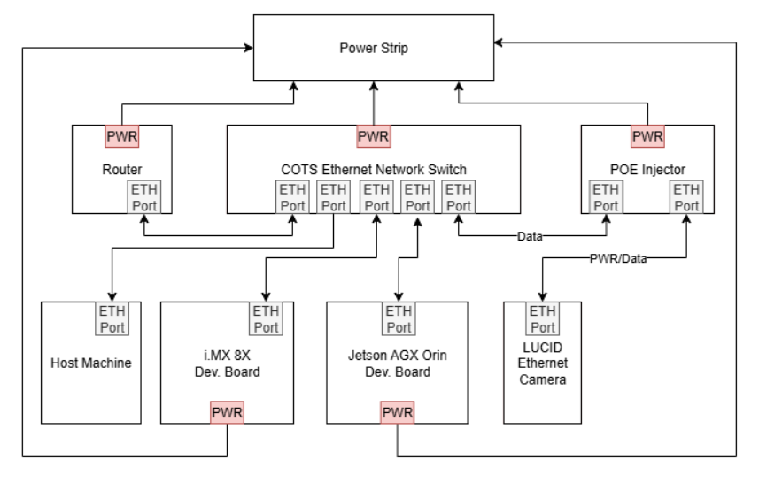

Watch our video demo on [YouTube](https://youtu.be/-g3Wv_fr9r8?si=2xow8_22aNjE1XDO)!

Check out our [docs page](https://scales-docs.readthedocs.io/en/latest/)!

# SCALES Demo Development

This demo combines the F Prime Hub Pattern developed by the SCALES team with COTS evaluation boards for the Flight Computer and Edge Computer. The demo aims to accomplish the following:

- Test the capability of the split computing architecture
- Test the capability of using a network ethernet switch in this architecture
- Test the command and data handling aspects of the Flight Computer
- Test using the Hub Pattern to have the Flight Computer command the Edge Computer

Watch our video demo on [YouTube](https://youtu.be/-g3Wv_fr9r8?si=2xow8_22aNjE1XDO)!

Code and reference deployment can be found on our [fprime-scales-ref](https://github.com/BroncoSpace-Lab/fprime-scales-ref/tree/main) GitHub.

## Setup

The i.MX8X Flight Computer evaluation board, Jetson Edge Computer evaluation board, and COTS ethernet camera will be connected through a COTS managed ethernet switch. The i.MX will command the Jetson through the Hub Pattern to take a picture using the Ethernet Camera. The picture will be saved on the Jetson. When completed, the i.MX will command the Jetson through the Hub Pattern to run a computer vision algorithm on the images taken with the camera. The results will be sent to the i.MX.

<div style="text-align: center;">
    
    </div>

## Process

Using a pre-existing F Prime deployment, we created a new component called RunLucidCamera. The component achieves the following:

- GDS command to set up the camera and make sure it is connected
- GDS command to take a picture and save an image from the ethernet camera

We recycled and modified existing example code from the ethernet camera's SDK. To do this, we needed to integrate the Arena SDK for the ethernet camera into the F Prime deployment. 

### Arena SDK in F Prime

The Arena SDK was installed from [Lucid](https://thinklucid.com/downloads-hub/)

1. Create a `lib` folder in the root directory of the project.
2. In `fprime-scales-ref/project.cmake` add the `lib` folder as a subdirectory.
3. Copy the Arena SDK folders into `lib` at `fprime-scales-ref/lib/ArenaSDK`
4. Make a CMakeLists.txt files at `fprime-scales-ref/lib/CMakeLists/txt` and add the following: `add_fprime_subdirectory("${CMAKE_CURRENT_LIST_DIR}/ArenaSDK")`
5. Make a new CMakeLists.txt at `fprime-scales-ref/lib/ArenaSDK/CMakeLists/txt` and add the Arena SDK library paths. Currently, the only way this worked was to add the paths to the exact files we wanted. 

    ```
    set(MODULE_NAME lib_ArenaSDK)

    add_library(${MODULE_NAME} INTERFACE)
    target_include_directories(${MODULE_NAME} INTERFACE
        ${CMAKE_CURRENT_LIST_DIR}/include/Arena
        ${CMAKE_CURRENT_LIST_DIR}/GenICam/library/CPP/include
        ${CMAKE_CURRENT_LIST_DIR}/include/Save
        ${CMAKE_CURRENT_LIST_DIR}/include/GenTL
        )

    target_link_libraries(${MODULE_NAME} INTERFACE
        # Your existing libraries
        Components_RunLucidCamera
        
        # Arena SDK libraries - provide full paths to .so or .a files
        ${CMAKE_CURRENT_LIST_DIR}/lib/libarena.so          # Core Arena library
        ${CMAKE_CURRENT_LIST_DIR}/lib/libarena.so.0          # Core Arena library
        ${CMAKE_CURRENT_LIST_DIR}/lib/libsavec.so          # Save functionality
        ${CMAKE_CURRENT_LIST_DIR}/lib/libgentl.so          # GenTL functionality
        ${CMAKE_CURRENT_LIST_DIR}/lib/liblucidlog.so       # Lucid logging
        ${CMAKE_CURRENT_LIST_DIR}/lib/libsave.so
        ${CMAKE_CURRENT_LIST_DIR}/lib/libarenac.so

        ${CMAKE_CURRENT_LIST_DIR}/ffmpeg/libavcodec.so
        ${CMAKE_CURRENT_LIST_DIR}/ffmpeg/libavformat.so
        ${CMAKE_CURRENT_LIST_DIR}/ffmpeg/libavutil.so
        ${CMAKE_CURRENT_LIST_DIR}/ffmpeg/libswresample.so


        # GenICam libraries
        ${CMAKE_CURRENT_LIST_DIR}/GenICam/library/lib/Linux64_ARM/libGenApi_gcc54_v3_3_LUCID.so
        ${CMAKE_CURRENT_LIST_DIR}/GenICam/library/lib/Linux64_ARM/libGCBase_gcc54_v3_3_LUCID.so
        ${CMAKE_CURRENT_LIST_DIR}/GenICam/library/lib/Linux64_ARM/libMathParser_gcc54_v3_3_LUCID.so
        ${CMAKE_CURRENT_LIST_DIR}/GenICam/library/lib/Linux64_ARM/liblog4cpp_gcc54_v3_3_LUCID.so
        ${CMAKE_CURRENT_LIST_DIR}/GenICam/library/lib/Linux64_ARM/libLog_gcc54_v3_3_LUCID.so
        ${CMAKE_CURRENT_LIST_DIR}/GenICam/library/lib/Linux64_ARM/libNodeMapData_gcc54_v3_3_LUCID.so
        ${CMAKE_CURRENT_LIST_DIR}/GenICam/library/lib/Linux64_ARM/libXmlParser_gcc54_v3_3_LUCID.so
    )
    ```

6. In `fprime-scales-ref/Components/RunLucidCamera/RunLucidCamera.cpp`, update the include path to `#include "ArenaApi.h"` and `#include SaveApi.h`, and integrate the `CppSave_Png.cpp` example code from the Arena SDK into the `RunLucidCamera.cpp`. The constructor and deconstructor for the component was modified to include parts of the Arena SDK example code. We also modified the way the example code was saving the images so the old images don't get overwritten. The current code is [here](https://github.com/BroncoSpace-Lab/fprime-scales-ref/tree/main/Components/RunLucidCamera). 

---

# To Run the SCALES Demo

# fprime-scales-ref F' project

Watch our video demo on [YouTube](https://youtu.be/-g3Wv_fr9r8?si=2xow8_22aNjE1XDO)!

Check out our [docs page](https://scales-docs.readthedocs.io/en/latest/)!

### Development Environment

May or may not be required, but this is what we found best to use for development:

- Ubuntu 22.04 host machine
- python3.11
- git lfs (install [here for amd64](https://git-lfs.com/) and [here for arm64](https://github.com/git-lfs/git-lfs/releases/download/v3.7.0/git-lfs-linux-arm64-v3.7.0.tar.gz))

## How to Clone

Use the commands below in terminal to clone and set up the repository. Make sure to source the fprime-venv before you continue developing! **Make sure you have [git lfs](https://git-lfs.com/) installed before proceeding.**

```
git clone https://github.com/BroncoSpace-Lab/fprime-scales-ref.git
cd fprime-scales-ref
make setup
make arena-init
source fprime-venv/bin/activate
```

### Necessary Changes

Some lines need to be commented in `lib/fprime/cmake/API.cmake` in order to use `fprime-python`. Comment out lines [545](https://github.com/nasa/fprime/blob/5a3b873854fe4d646d6874d134585535652fddb9/cmake/API.cmake#L545) and [562](https://github.com/nasa/fprime/blob/5a3b873854fe4d646d6874d134585535652fddb9/cmake/API.cmake#L562).

After this, you should be good to go!

## Hardware Setup

These directions are currently only for the FlatSat, not the custom boards the SCALES team has developed.

Make sure your hardware is configured as follows:

<div style="text-align: center;">
    
    </div>

<div style="text-align: center;">
    
    </div>

## How to Build JetsonDeployment

You must generate build JetsonDeployment on the Jetson, we have not set up cross-compilation for aarch64-linux yet.

<details>

<summary> JetsonDeployment Build Configuration Details </summary>

Your `settings.ini` should look like this:

```
[fprime]
project_root: .
framework_path:     ./lib/fprime
; uncomment this line for JetsonDeployment
library_locations:  ./lib/fprime-python:./lib/fprime-scales
; uncomment this line for ImxDeployment
; library_locations:  ./lib/fprime-scales:

default_cmake_options:  FPRIME_ENABLE_FRAMEWORK_UTS=OFF
                        FPRIME_ENABLE_AUTOCODER_UTS=OFF
```

Your `project.cmake` should look like this:

```
# This CMake file is intended to register project-wide objects.
# This allows for reuse between deployments, or other projects.

add_fprime_subdirectory("${CMAKE_CURRENT_LIST_DIR}/Components")
# add_fprime_subdirectory("${CMAKE_CURRENT_LIST_DIR}/ImxDeployment/")
add_fprime_subdirectory("${CMAKE_CURRENT_LIST_DIR}/JetsonDeployment/")
add_fprime_subdirectory("${CMAKE_CURRENT_LIST_DIR}/lib/")
# add_fprime_subdirectory("${CMAKE_CURRENT_LIST_DIR}/lib/fprime-scales/scales/scalesSvc")
```

Your `CMakeLists.txt` in the root project directory should have line 17 containing `register_fprime_target("${CMAKE_SOURCE_DIR}/lib/fprime-python/cmake/target/pybind.cmake")` **uncommented**.

Your `Components/CMakeLists.txt` should look like this:

```
# Include project-wide components here

# add_fprime_subdirectory("${CMAKE_CURRENT_LIST_DIR}/StandardBlankComponent/")
# add_fprime_subdirectory("${CMAKE_CURRENT_LIST_DIR}/PythonComponent/")
add_fprime_subdirectory("${CMAKE_CURRENT_LIST_DIR}/MLComponent/")
add_fprime_subdirectory("${CMAKE_CURRENT_LIST_DIR}/RunLucidCamera/")
```

</details>

After all of this, **on the Jetson** you should be able to generate and build the JetsonDeployment.

To generate: 

```
fprime-util generate aarch64-linux -f
```

To build and set up the build environment:

```
make build-jetson
```

**On the Jetson**, should be able to generate and build the JetsonDeployment with the commands below:

```
fprime-util generate aarch64-linux -f
make build-jetson
```

The `make build-jetson` command will `fprime-util build aarch64-linux` and create a linked folder for the camera images. This command also runs a script to create the build environment for fprime-python on the Jetson.

## ImxDeployment

To correctly generate and build for the IMX, you need to have the build environment on your machine. Refer to [this guide](https://scales-docs.readthedocs.io/en/latest/imx_yocto_bsp/#building-the-bsp) we made on our docs for how to set up the IMX SDK.

<details>

<summary> ImxDeployment Build Configuration Details </summary>

### For Successful Build

Your `settings.ini` should look like this:

```
[fprime]
project_root: .
framework_path:     ./lib/fprime
; uncomment this line for JetsonDeployment
; library_locations:  ./lib/fprime-python:./lib/fprime-scales
; uncomment this line for ImxDeployment
library_locations:  ./lib/fprime-scales

default_cmake_options:  FPRIME_ENABLE_FRAMEWORK_UTS=OFF
                        FPRIME_ENABLE_AUTOCODER_UTS=OFF
```

Your `project.cmake` should look like this:

```
# This CMake file is intended to register project-wide objects.
# This allows for reuse between deployments, or other projects.

# add_fprime_subdirectory("${CMAKE_CURRENT_LIST_DIR}/Components")
add_fprime_subdirectory("${CMAKE_CURRENT_LIST_DIR}/ImxDeployment/")
# add_fprime_subdirectory("${CMAKE_CURRENT_LIST_DIR}/JetsonDeployment/")
# add_fprime_subdirectory("${CMAKE_CURRENT_LIST_DIR}/lib/")
# add_fprime_subdirectory("${CMAKE_CURRENT_LIST_DIR}/lib/fprime-scales/scales/scalesSvc")
```

Your `CMakeLists.txt` in the root project directory should have line 17 containing `register_fprime_target("${CMAKE_SOURCE_DIR}/lib/fprime-python/cmake/target/pybind.cmake")` **commented**.

Your `Components/CMakeLists.txt` should look like this:

```
# Include project-wide components here

# add_fprime_subdirectory("${CMAKE_CURRENT_LIST_DIR}/StandardBlankComponent/")
# add_fprime_subdirectory("${CMAKE_CURRENT_LIST_DIR}/PythonComponent/")
# add_fprime_subdirectory("${CMAKE_CURRENT_LIST_DIR}/MLComponent/")
# add_fprime_subdirectory("${CMAKE_CURRENT_LIST_DIR}/RunLucidCamera/")
```

</details>


After all of this, you should be able to generate and build the ImxDeployment on your host machine.

To generate: 

```
fprime-util generate imx8x -f
```

To build:

```
fprime-util build imx8x
```

Generate and build the ImxDeployment on your host machine with the commands below:

```
fprime-util generate imx8x -f && fprime-util build imx8x -j20
```

# To Run the SCALES Demo

## IMX Setup

These steps are only required if there are changes made to ImxDeployment. Otherwise, the binary on the IMX should be fine.

1. Follow the instructions above to build ImxDeployment on the host machine. Use the following command to ssh into the IMX.

    ```
    ssh root@<ip of imx> -o HostKeyAlgorithms=+ssh-rsa -o PubKeyAcceptedAlgorithms=+ssh-rsa
    ```

2. Make sure you are able to ping both the host machine and the Jetson from the IMX. Copy the ImxDeployment binary from the host machine to the IMX. (Run this command on the host machine.)

    ```
    scp -oHostKeyAlgorithms=+ssh-rsa -oPubkeyAcceptedKeyTypes=+ssh-rsa ~/fprime-scales-ref/build-artifacts/imx8x/ImxDeployment/bin/ImxDeployment root@<ip of imx>:~/.
    ```

3. Copy the binary files for the sequences to the IMX.

    ```
    scp -oHostKeyAlgorithms=+ssh-rsa -oPubkeyAcceptedKeyTypes=+ssh-rsa ~/fprime-scales-ref/Sequences/save-png.bin root@<ip of imx>:~/.
    scp -oHostKeyAlgorithms=+ssh-rsa -oPubkeyAcceptedKeyTypes=+ssh-rsa ~/fprime-scales-ref/Sequences/batch-send-img.bin root@<ip of imx>:~/.
    scp -oHostKeyAlgorithms=+ssh-rsa -oPubkeyAcceptedKeyTypes=+ssh-rsa ~/fprime-scales-ref/Sequences/snap-n-save.bin root@<ip of imx>:~/.
    scp -oHostKeyAlgorithms=+ssh-rsa -oPubkeyAcceptedKeyTypes=+ssh-rsa ~/fprime-scales-ref/Sequences/Zip-n-send.bin root@<ip of imx>:~/.
    scp -oHostKeyAlgorithms=+ssh-rsa -oPubkeyAcceptedKeyTypes=+ssh-rsa ~/fprime-scales-ref/Sequences/test-resnet.bin root@<ip of imx>:~/.
    scp -oHostKeyAlgorithms=+ssh-rsa -oPubkeyAcceptedKeyTypes=+ssh-rsa ~/fprime-scales-ref/Sequences/demo.bin root@<ip of imx>:~/.
    scp -oHostKeyAlgorithms=+ssh-rsa -oPubkeyAcceptedKeyTypes=+ssh-rsa ~/fprime-scales-ref/Sequences/run-ml.bin root@<ip of imx>:~/.
    ```

## Jetson Setup

1. On the Jetson, follow the above directions to generate and build JetsonDeployment.

2. Change the IP of the IMX in `Jetsondeployment/Top/JetsonDeploymentTopology.cpp` to match the IP of the IMX.

    ```
    // line 32
    const char* REMOTE_HUIP_ADDRESS = "10.3.2.2"; // ip of JPL IMX
    // const char* REMOTE_HUIP_ADDRESS = "192.168.0.66"; // ip of CPP IMX
    const U32 REMOTE_HUPORT = 50500;
    ```

3. Rebuild JetsonDeployment.

    ```
    make build-jetson
    ```

4. **For first time setup only:** Make a folder with a symbolic link to where the camera images are saved. This is done to assure the paths for commands in the fprime-gds are not too long.

    ```
    sudo ln -s ~/fprime-scales-ref/build-python-fprime-aarch64-linux/Images/ ./Images
    sudo ln -s ~/fprime-scales-ref/build-pyhon-fprime-aarch64-linux/Images/ ./Images
    ```

    The `Images` folder will be created in your root directory.

## Host Setup

1. Open another terminal on the host machine and enter the directory for the repo and source your environment.

    ```
    cd fprime-scales-ref
    source fprime-venv/bin/activate
    ```

2. Copy the ImxDeployment dictionary to the GDS-Dictionary folder on the host machine. Run this command on the host machine.

    ```
    cp ~/fprime-scales-ref/build-artifacts/imx8x/ImxDeployment/dict/ImxDeploymentTopologyAppDictionary.xml ~/fprime-scales-ref/GDS-Dictionary/.
    ```

3. Copy the JetsonDeployment dictionary from the Jetson to the host machine. Run this command on the host machine.

    ```
    scp <jetson name>@<jetson IP>:~/fprime-scales-ref/build-artifacts/aarch64-linux/JetsonDeployment/dict/JetsonDeploymentTopologyAppDictionary.xml ~/fprime-scales-ref/GDS-Dictionary/.
    ```

6. Combine the GDS dictionaries with the `merger.py` script. Run this command on the host machine.

    ```
    cd GDS-Dictionary
    python merger.py JetsonDeploymentTopologyAppDictionary.xml ImxDeploymentTopologyAppDictionary.xml GDSDictionary.xml
    ```

You are now ready to run the demo!

## Running the Demo

1. After you finished setting up the demo in the previous section, **on the host machine**, navigate to the `GDS-Dictionary` folder and run the fprime-gds.

    ```
    fprime-gds -n --dictionary GDSDictionary.xml --ip-client --ip-address <ip of imx>
    ```

2. **On the IMX**, run the ImxDeployment binary. You should see a green dot on the fprime-gds and "Accepted client" in the IMX terminal.

    ```
    ./ImxDeployment -a 0.0.0.0 -p 50000
    ```

3. **On the Jetson**, navigate to the `build-python-fprime-aarch64-linux` directory to run the fprime-gds using python.

    ```
    cd build-python-fprime-aarch64-linux
    python -c "import python_extension; python_extension.main()"
    ```

    This command opens the python environment and connects to the IMX's fprime-gds using the hub pattern. If you want to exit the python environment, the command is `exit()`.

4. **On the host machine**, use the fprime-gds to run the `jetson_cmdDisp.CMD_NO_OP` to test the connection with the Jetson. Do the same for the IMX with the `imx_cmdDisp.CMD_NO_OP`. You should be able to see that both events completed in the "Events" tab of the gds.

5. Once the camera is connected (flashing green light on camera), run the `jetson_lucidCamera.SETUP_CAMERA` command to verify the connection via fprime. 

6. To take a picture with the camera, run the `imx_cmdSeq.CD_RUN` command in the fprime-gds with argument `demo.bin`. This will take a pictire with the camera, downlink it to the IMX, and then downlink it again to the Host Machine. You can download the image from the `Downlink` tab in the GDS. This sequence will also run a resnet ML model to identify what is in the image. The output will be displayed in the Events tab of the GDS. Images are deleted from the Jetson after the `demo.bin` sequence concludes. Repeat this step if you wish to take more images.

    <div style="text-align: center;">
    
    </div>
    
    This sequence will trigger the Images from the Jetson to be downlinked to the IMX, and then again downlinked from the IMX to the Host Machine. Check the `Downlink` tab in the GDS to see the images.

    <div style="text-align: center;">
    
    </div>

    Click the `Download` button in the `Downlink` tab of the fprime-gds to download the zipped Image folder to the host machine. You can then unzip the folder and view the images from the Jetson!

### Alternative Commands

1.  If you would like to send a batch of images from the Jetson to the Host Machine, run a sequence on the IMX using the `imx_cmdSeq.CS_RUN` command on the fprime-gds with fileName argument `send.bin`. The Command String is as follows:

    ```
    imx_cmdSeq.CS_RUN, "send.bin", BLOCK
    ```

    <div style="text-align: center;">
    
    </div>
    
    This sequence will trigger the Images from the Jetson to be zipped into a smaller file to be downlinked to the IMX, and then again downlinked from the IMX to the Host Machine.

    <div style="text-align: center;">
    
    </div>

    Click the `Download` button in the `Downlink` tab of the fprime-gds to download the zipped Image folder to the host machine. You can then unzip the folder and view the images from the Jetson!

2.  To run ML on the images, run the `mlManager.SET_ML_PATH` command with argument `resent_inference`. Then, set the inference path to where the images are stored with the `mlManager.SET_INFERENCE_PATH` command with argement `../Images`. Finally, run the ML model with command `mlManager.MULTI_INFERENCE`. You should see the results of the ML model both in the Jetson's terminal and in the Jetson's fprime-gds Events log.

That's how to run the SCALES demo!

Watch our video demo on [YouTube](https://youtu.be/-g3Wv_fr9r8?si=2xow8_22aNjE1XDO)! Some minor changes have been implemented since the creation of this video, but the core process remains the same.

# To Run Scales-ML

[Scales-ML](https://github.com/BroncoSpace-Lab/Scales-ML/tree/e3aa59f606e9325cd198b787543cea0341d9a19a)

1. Follow the setup described in previous sections for the IMX, Jetson, and Host Machine.

2. In the fprime-gds, run the `imx_cmdSeq.CS_RUN` command with argument `test-resnet.bin`. This sequence will:

    - Set the ML path to a resnet model
    - Set the inference path to a folder called `test-imagery` with example images
    - Execute the `MULTI_INFERENCE` command to inference on all images in that folder.

# Troubleshooting

When trying to run the SCALES demo, you may encounter a few issues.

### Hanging/Crashing During Downlink

This is because there is an exisiting file on the IMX names `image.png` from a previous, incomplete run of the demo. Just delete the `image.png` file from the IMX with `rm image.png` and try running the demo again.

This also may be due to an issue with the `Images/` folder on the Jetson. Return to step 4 in Jetson Setup to make sure you have the `Images/` folder set up correctly.

### fprime-gds Crashes on Jetson When Trying to Connect

Instead of doing the shortened command to connect to the gds from the Jetson, try entering the python environment first and then running `import python_extension` and `python_extension.main()` one at a time.

### Inferencing Error

When trying to run the `MULTI_INFERENCE` command on the Jetson, you may experience an error similar to:

```
'(MaxRetryError("HTTPSConnectionPool(host='huggingface.co', port=443): Max retries exceeded with url: /microsoft/resnet-18/resolve/main/preprocessor_config.json (Caused by NewConnectionError('<urllib3.connection.HTTPSConnection object at 0xffff3bf23450>: Failed to establish a new connection: [Errno -3] Temporary failure in name resolution'))"), '(Request ID: 6d6a5cec-e762-484c-a97a-1e1d9748bcba)')' thrown while requesting HEAD https://huggingface.co/microsoft/resnet-18/resolve/main/preprocessor_config.json
```

Make sure the Jetson is connected to WiFi and try again. This is a new issue we have encountered that we are still trying to find the root cause of, but a WiFi connection fixes the issue.

---

This project was auto-generated by the F' utility tool. 

F´ (F Prime) is a component-driven framework that enables rapid development and deployment of spaceflight and other embedded software applications.
**Please Visit the F´ Website:** https://fprime.jpl.nasa.gov.